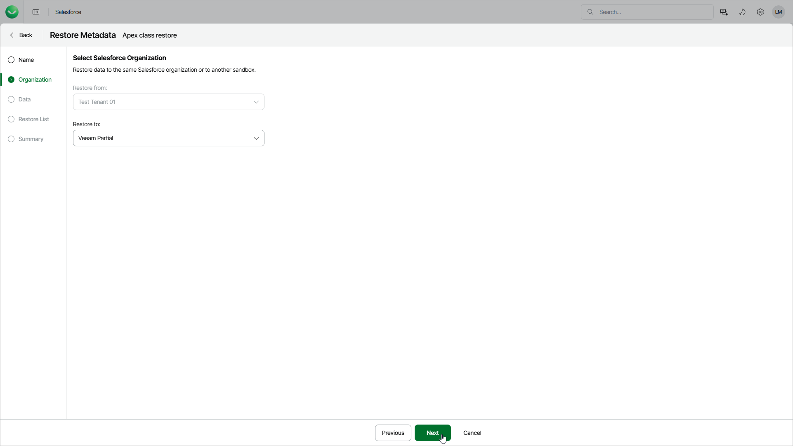

# Step 3. Select Target Tenant

In this article

At the Organization step of the wizard, you can choose to restore metadata to the same Salesforce tenant or its sandbox copy.

To select another target tenant, use the Restore to drop-down list. The list contains only Salesforce tenants that are compatible with the source tenant.

|  |
| --- |
| Important |
| The source and target Salesforce tenants must be located in the same region. |

Page updated 8/22/2025
