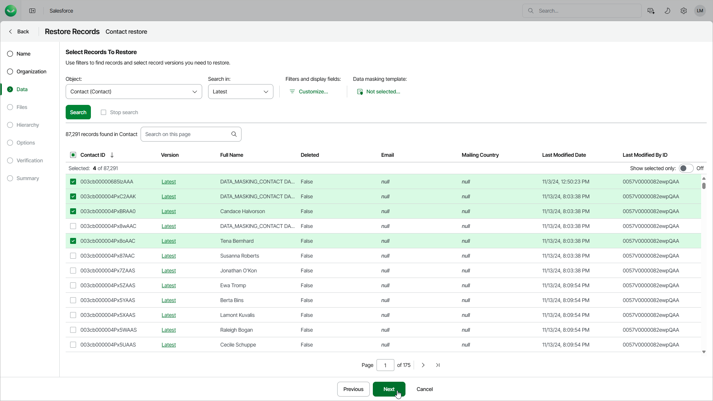

# Step 4. Choose Data to Restore

At the Data step of the wizard, do the following:

1. From the Object list, select a Salesforce root object whose data you want to restore.

The list contains Salesforce objects that have a backup. If the list does not contain the necessary object, the object either does not have a backup or cannot be restored. The object may not have a backup for the following reasons:

* The object was excluded from the backup policy that protects the Salesforce tenant to which this object belongs.
* The Salesforce user whose permissions are used for backup operations does not have access to the object.
* Backup of the object is not supported in the current product version. For more information, see [Unsupported Salesforce Objects](sf_unsupported_objects.md).

1. Select one of the following options to filter record versions:

* If you select the Latest option, Veeam Data Cloud will display the latest record versions only.
* If you select the Backup Date option, Veeam Data Cloud will display the latest record versions prior to a specific date. To modify the date, click the Schedule icon in the Date field.
* If you select the Modified Date option, Veeam Data Cloud will display all record versions for a specific time period. To modify the time period, click the Schedule icon in the Date field.

1. [Optional] To apply specific search conditions and reduce the number of search results, click Customize in the Filters and display fields field.

Veeam Data Cloud provides a number of built-in conditional operators (such as contains, equals, starts with, is null and so on) that can be used to send requests to databases. When adding conditions, consider the following:

* If you want to search for records with null field values, use the is null operator. Using the equals operator in this case is not supported.
* If you want to search for a list of records, you can use the in operator and specify the IDs of the necessary records using a comma-separated list.
* If you want to search for a record but you do not have any information on this record except for the fact that it is linked to a specific object, you can use the lookup relationship field to filter all records linked to this object. To do that, specify the ID of the necessary object in the Value field. The Value field is case sensitive for the following operators: starts with, ends with, equals, in, not equal to, not in.
* If you want to search for records that have been archived, use the vsf\_archived (Archive Restore Point) field.

|  |
| --- |
| Note |
| * The time required to process a request depends on the operator you use — for example, processing a request with the equals operator will take less time than processing a request with the contains operator. * If a record that you want to restore contains encrypted fields, you will not be able to specify filters for these fields. |

By default, filters are combined by the AND logical operator. That is, a record is displayed in the search results only if all the specified conditions are met. You can change this behavior by combining filters using different operators. To do that, set the Use filter logic toggle to On, and specify the filter logic expression using condition ordinal numbers, brackets and logical operators — for example, 1 AND (2 OR 3) AND NOT 4.

1. To display the list of records that meet the search conditions, click Search.
2. Select the records that you want to restore. You can select up to 500,000 records for one restore job.

You can also choose the version of each record that will be restored. To do that, click the link in the Version column and select the necessary record version from the Restore point drop-down list.

|  |
| --- |
| Note |
| * You can use the Search on this page field to search the records on the currently displayed page. To search across all available records, use the filter functionality. * To help you choose a version, Veeam Data Cloud displays both the content of the selected backed-up record and the content of the record currently stored in Salesforce. If you want to view only those record fields that have changed since the backup was created, set the Compare changes toggle to On. * If the selected records contain encrypted fields, only users assigned the OrganizationAdmin, Salesforce:Administrator and Salesforce:BackupOperator roles will be able to view and compare values of these fields. |

1. [Applies only when restoring to a non-production tenant] If you want to apply a masking template to the restored data, click the link in the Data masking template field. For a template to be displayed in the list of available templates, it must be created by an Administrator as described in section [Managing Data Masking Templates](sf_settings_templates.md).

|  |
| --- |
| Note |
| * When you restore data to a non-production Salesforce tenant, Veeam Data Cloud does not, by default, restore the values of fields that are encrypted in the source Salesforce tenant. If you want to populate these fields with values, do one of the following:  * Provide override values for these fields. For details, see [Configure Additional Restore Settings](sf_restore_records_options.md). * Configure and use a data masking template for the target Salesforce tenant.  * When you restore data from a non-production to a production Salesforce tenant, Veeam Data Cloud does not restore encrypted fields in the target Salesforce tenant, because sandbox tenants store placeholder values for encrypted fields rather than actual data. |

