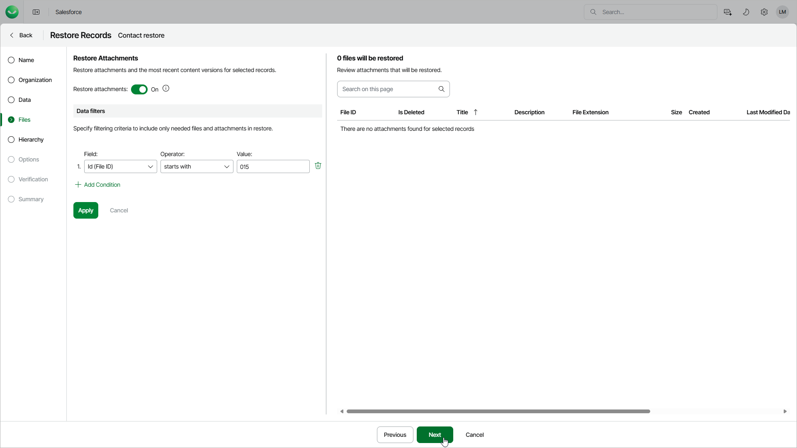

# Step 5. Choose Files to Restore

At the Files step of the wizard, you can choose record files that you want to restore. To do that, set the Restore attachments toggle to On and apply filters to choose necessary files. If you do not specify any filtering conditions, Veeam Data Cloud will restore all files associated with the selected record.

Veeam Data Cloud provides a number of built-in conditional operators (such as contains, equals, starts with, is null and so on) that can be used to send requests to databases. Note that the time required to process a request depends on the operator you use — for example, processing a request with the equals operator will take less time than processing a request with the contains operator.

For a file to be displayed in the list of available files, it must be associated with the selected record and have a backup.

|  |
| --- |
| Important |
| * When restoring an encrypted file to a production tenant, Veeam Data Cloud will decrypt the file and fully restore its content. However, if you restore an encrypted file to a sandbox tenant, Veeam Data Cloud will not decrypt the file for security reasons and therefore will create only an empty copy of this file. * Using this type of restore, you can restore only the latest version of a file. If you want to restore any of the previous file versions, create a file restore job. For details, see [Restoring Files](sf_restore_files.md). |

