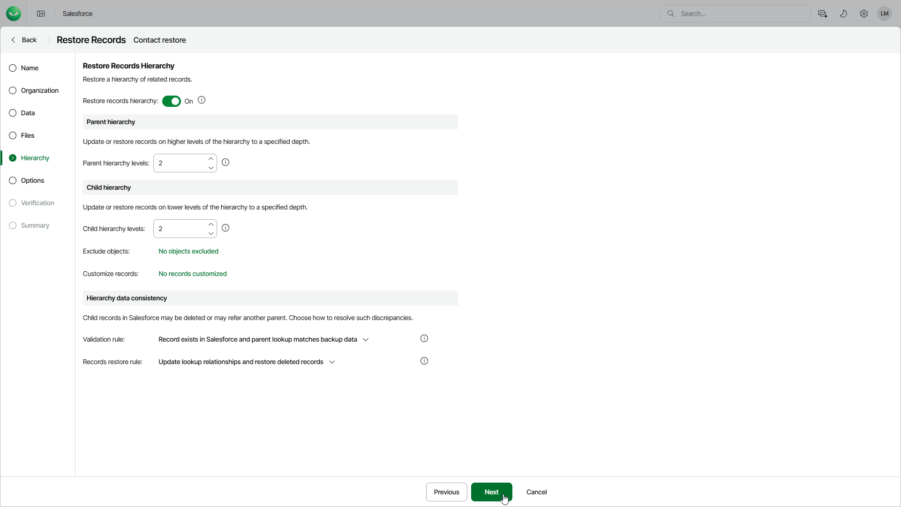

# Step 6. Enable Hierarchy Restore

In this article

At the Hierarchy step of the wizard, you can specify parent and child records to restore. While restoring hierarchy, Veeam Data Cloud analyzes all lookup relationship fields of the records and compares backed-up data with the current Salesforce data. For more information, see [How Object Hierarchy Restore Works](sf_how_hierarchy_restore_works.md).

|  |
| --- |
| Important |
| * If you have enabled restore of files at the previous step, Veeam Data Cloud will not restore files and attachments of child and parent records. If you want to restore files and attachments of child and parent records, create a [file restore job](sf_restore_files.md). * When restoring a record from the Salesforce Recycle Bin, Veeam Data Cloud automatically restores child records that are linked using master-detail relationships even if the hierarchy restore option is disabled. * If you have selected to mask data at the [Data](sf_restore_records_data.md) step, Veeam Data Cloud will also mask the data of child and parent records. |

To restore lookup relationships, set the Restore records hierarchy toggle to On and do the following:

1. In the Parent hierarchy section, select the maximum level of the parent object hierarchy that will be restored for all records. By default, Veeam Data Cloud restores the 1st level parent records only.

The restore parent hierarchy settings are applied to every record in the session and not only to the records selected the [Data](sf_restore_records_data.md) step. It means that Veeam Data Cloud will restore the record and then will verify lookup links to its parent records. This process will repeat for all the selected child records.

|  |
| --- |
| Note |
| When restoring from a production to a sandbox tenant, it is recommended that you restore at least 2 levels of the parent hierarchy. |

1. In the Child hierarchy section, configure the following settings:

1. In the Child hierarchy levels field, select the depth level of the child object hierarchy that will be restored for all records.
2. Click the link in the Exclude objects field to choose whether you want to exclude specific child objects from restore. Note that Veeam Data Cloud will also exclude all child objects associated with the objects that you specified.
3. Click the link in the Customize records field to customize child hierarchy settings for individual records. To configure settings for a record, click Customize and select check boxes next to the objects whose records you want to restore in the Customize Hierarchy Restore window. Veeam Data Cloud will restore records of the child objects that you have selected only — if you do not expand the object node, child objects under the node remain unselected and records of those objects will not be restored.

1. In the Hierarchy data consistency section, configure the following settings:

1. From the Validation rule drop-down list, choose when to stop updating the child records:

* To stop proceeding to deeper levels of the hierarchy if a child record exists in Salesforce, select Record exists in Salesforce. This child record will be the last updated record. Keep in mind that it will be updated according to the selected Records restore rule option.
* To stop proceeding to deeper levels of the hierarchy if a child record exists in Salesforce and the lookup field value matches the backed-up value, select Record exists in Salesforce and parent lookup matches backup data. This child record will be the last updated record. Keep in mind that it will be updated according to the selected Records restore rule option.
* To stop proceeding to deeper levels of the hierarchy if a child record exists in Salesforce and the values of all fields of the record match the backed-up values, select Record exists in Salesforce and all fields match backup data.
* To proceed to deeper levels of the hierarchy until the specified child hierarchy level is reached or all the child records with the configured custom hierarchy settings are updated, select Always check entire hierarchy tree.

1. From the Records restore rule drop-down list, choose what fields will be updated for existing child records:

* To restore deleted records without updating the parent lookup fields of the existing child records, select Restore deleted records. Do not update existing records.
* To update only the parent lookup fields of the existing child records, select Update lookup relationships and restore deleted records.
* To update all fields of the existing child records without replacing current field values in Salesforce with null, select Update all field values, ignoring empty values, and restore deleted records.
* To update fields of the existing child records and replace current field values in Salesforce with null, select Update all filed values, including empty values, and restore deleted records.

|  |
| --- |
| Note |
| Veeam Data Cloud restores child and parent records of the versions that you selected at the [Data](sf_restore_records_data.md) step. This means that if you restore the latest version of a root record, the product restores the latest versions of related child and parents records. However, if you restore a specific version of the root record, the product restores the same or previous versions of the child and parent records. |

Page updated 8/22/2025
