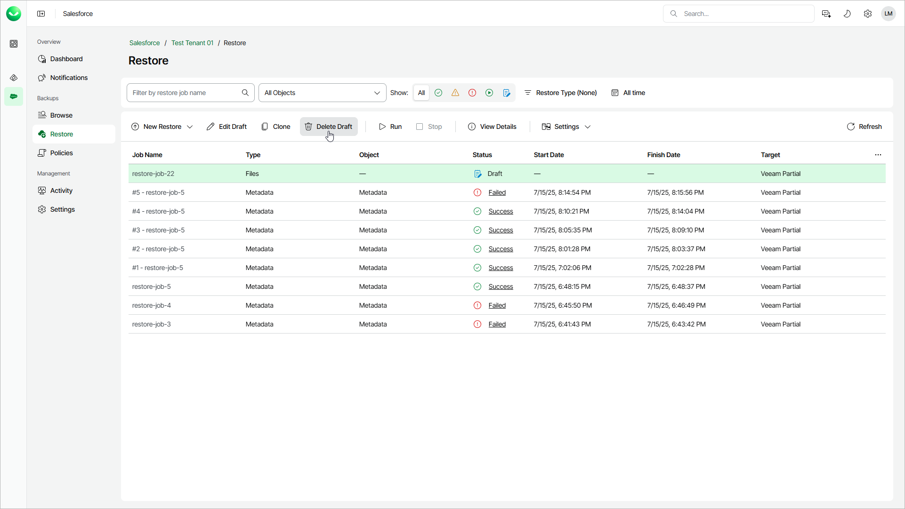

# Removing Restore Job Drafts

In this article

You to permanently remove a restore job draft from Veeam Data Cloud if you no longer need it. However, you cannot remove restore jobs that have already been launched.

To remove a restore job draft:

1. On the Salesforce page, click the name of the tenant you want to manage.
2. To view all restore jobs created for the tenant, select Restore on the left.
3. Select the necessary job draft.
4. Click Delete Draft.
5. In the Confirmation window, click Remove to acknowledge the operation.

Page updated 10/17/2025
