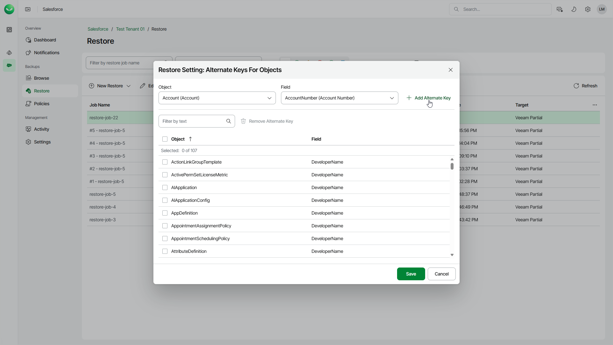

# Configuring Restore Mapping Settings

In this article

You can delete object mapping rules created automatically and add alternate keys that you want to use instead of record IDs. Veeam Data Cloud applies configured mapping settings to all restore jobs. For more information, see [How Restore Mapping Works](sf_restore_mapping.md).

Object IDs Mapping

When restoring a record that was deleted from Salesforce, Veeam Data Cloud creates a new record in Salesforce, assigns a new ID to this record and populates its fields with the values of the record from the backup. To associate the newly created record with the backed-up record, Veeam Data Cloud creates a default rule that maps the ID of the backed-up record with the ID of the record created in Salesforce.

You can delete a mapping rule if you no longer need it. When a mapping rule is deleted, Veeam Data Cloud will create a new record version. It is recommended that you delete mapping rules in a sandbox environment only.

To delete a mapping rule, do the following:

1. On the Salesforce page, click the name of the tenant you want to manage.
2. To view all restore jobs created for the tenant, select Restore on the left.
3. Select the necessary job.
4. Select Settings > Object IDs Mapping.
5. In the Restore Setting: Object IDs Mapping window, do the following:

1. Specify the ID of the record saved in the backup, the ID of the existing Salesforce record or both, and click Find Existing Mapping.
2. Click Remove.
3. Click Save to confirm that you want to remove the mapping rule.

|  |
| --- |
| Tip |
| To export the list that contains all mapping rules created for the restored records, click Export to CSV. Veeam Data Cloud will export all the mapping rules to a CSV file and download it to your local machine. |

Mapping by Alternate Keys

When restoring a Salesforce record, Veeam Data Cloud checks whether the record already exists in Salesforce. By default, the product uses the ID of the record saved in the backup to search for the record. However, you can add an alternate key and instruct Veeam Data Cloud to use this key instead of the record ID, that is, define a record field with a unique value that will be used to identify the restored record in case the product fails to find it by the record ID. For example, you can create a mapping rule and instruct the product to use a phone number or an email field instead of the default record ID.

|  |
| --- |
| Note |
| * Veeam Data Cloud searches for alternate keys only if a record does not exist in Salesforce and no [object mapping rules](#mapping_rule) have been applied. For details, see [How Restore Mapping Works](sf_restore_mapping.md). * If you restore records to another Salesforce tenant, Veeam Data Cloud does not use alternate keys that are configured in the target tenant. If you need to use alternate keys, configure them in the tenant from which you restore the records (source tenant). |

To add an alternate key, do the following:

1. On the Salesforce page, click the name of the tenant you want to manage.
2. To view all restore jobs created for the tenant, select Restore on the left.
3. Select the necessary job.
4. Select Settings > Alternate Keys.
5. In the Restore Setting: Alternate Keys for Objects window, do the following:

1. From the Object list, select an object for which you want to configure mapping.
2. From the Field list, select a field that will be used for mapping instead of the default record ID. The field value must be unique for the selected object.
3. Click Add Alternate Key.
4. To save the configured settings, click Save.

Page updated 10/17/2025
