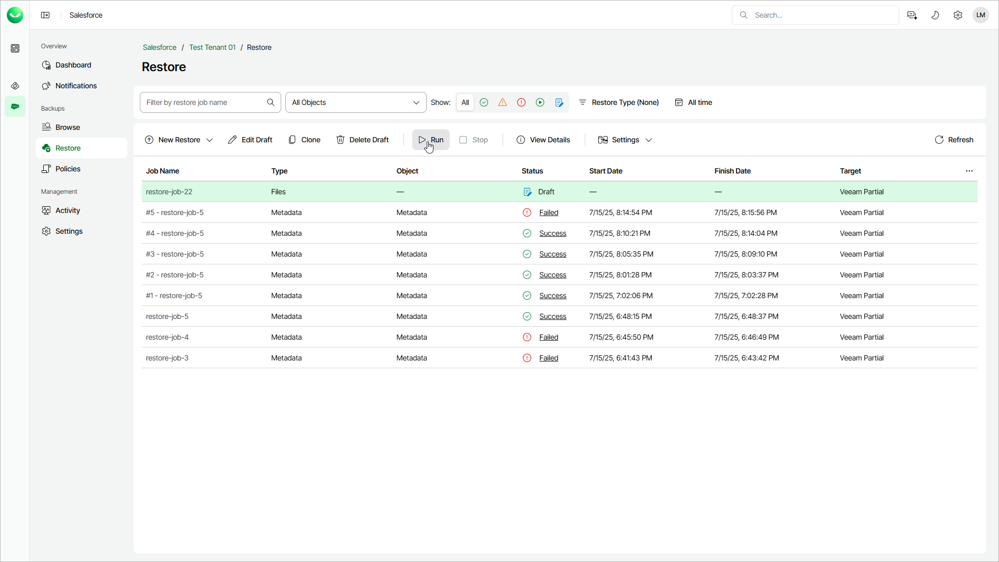

# Starting and Stopping Restore Jobs

In this article

You can start a restore restore automatically right after you finish the restore job configuration wizard or manually on the Restore tab. Consider that after you start a restore job, it cannot be edited or removed. However, you can clone this job after the restore session completes, and then edit it.

To start a restore job:

1. On the Salesforce page, click the name of the tenant you want to manage.
2. To view all restore jobs created for the tenant, select Restore on the left.
3. Select the necessary job.
4. Click Run.

You can stop a running restore job although it may result in data inconsistency. Consider that you cannot further edit, start or remove a stopped restore job.

To stop a restore job:

1. On the Salesforce page, click the name of the tenant you want to manage.
2. To view all restore jobs created for the tenant, select Restore on the left.
3. Select the necessary job.
4. Click Stop.

Page updated 10/17/2025
