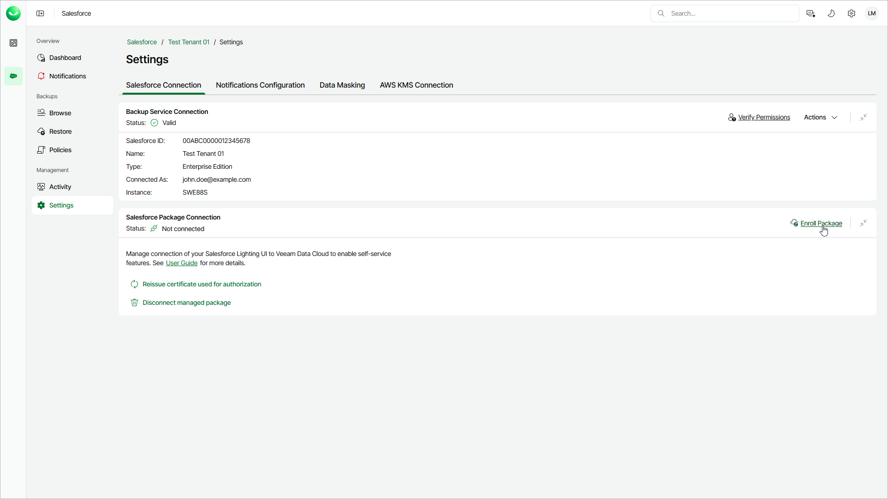
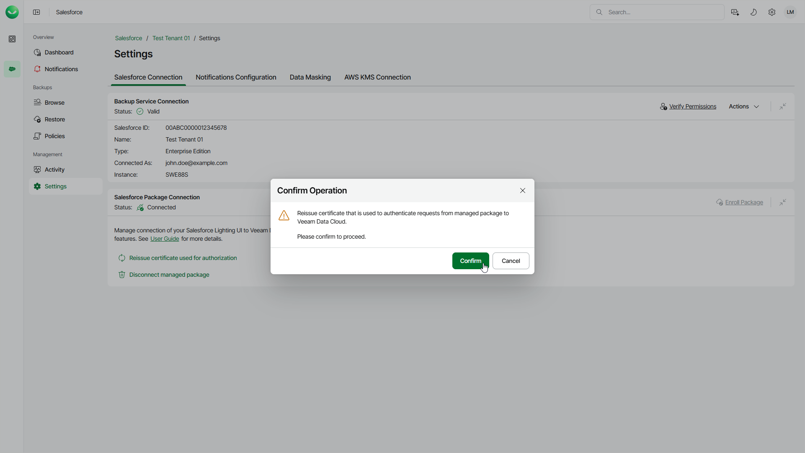
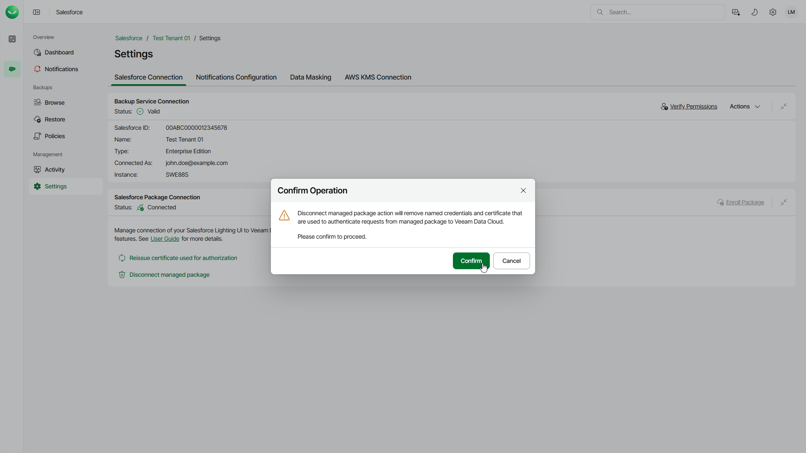

# Configuring Salesforce Package Connection

In this article

Veeam Data Cloud Salesforce Extension is a solution that is developed for fast access and restore of Salesforce archived data directly from the Salesforce console. The extension improves user experience and reduces administrative workload required to process data requests. This solution is available on the [Salesforce AppExchange page](https://appexchange.salesforce.com/) and it is installed in your Salesforce tenant using a Salesforce managed package. A managed package is a container that includes the components of a Salesforce application, and a mechanism for installing the application. For details, see [Salesforce Documentation](https://developer.salesforce.com/docs/atlas.en-us.packagingGuide.meta/packagingGuide/managed_packaging_intro.htm).

With Veeam Data Cloud Salesforce Extension, you can do the following:

* View archived data directly from the Salesforce console.
* Browse and preview archived records and files without restoring them.
* Restore single or multiple archived records, including records of the related child objects.
* Track and view recent restore operations.

For more information on how to configure and work with Veeam Data Cloud Salesforce Extension, see the [Veeam Data Cloud Salesforce Extension User Guide](https://redirect.veeam.com/helpvdcsftopicid%3D020).

Registering Veeam Data Cloud Salesforce Extension

To start working with Veeam Data Cloud Salesforce Extension, you must register it in Veeam Data Cloud. During the registration process, Veeam Data Cloud will create named credentials in your target Salesforce organization and will send a request to Salesforce to generate a certificate — it will be used to authenticate all requests from the Salesforce extension to Veeam Data Cloud. For more information on named credentials, see [Salesforce Documentation](https://help.salesforce.com/s/articleView?id=xcloud.named_credentials_about.htm&type=5).

Before you register Veeam Data Cloud Salesforce Extension, make sure that you have deployed the extension in your Salesforce tenant. For details, see the [Deployment](https://helpcenter.veeam.com/docs/vdc_salesforce_extension/userguide/deployment.html) section of the Veeam Data Cloud Salesforce Extension User Guide.

To register Veeam Data Cloud Salesforce Extension, follow these steps:

1. On the Salesforce page, click the name of the tenant you want to manage.
2. Select Settings.
3. Make sure that the Salesforce Connection tab is selected.
4. In the Salesforce Package Connection section, click Enroll Package.

Reissuing Authorization Certificate

If the certificate that is used to authenticate requests from the Salesforce extension to Veeam Data Cloud expires or it is revoked, you may need to reissue it.

To reissue the certificate, do the following:

1. On the Salesforce page, click the name of the tenant you want to manage.
2. Select Settings.
3. Make sure that the Salesforce Connection tab is selected.
4. In the Salesforce Package Connection section, click Reissue certificate used for authorization.
5. In the Confirm Operation window, click Confirm.

Disconnecting Veeam Data Cloud Salesforce Extension

If you no longer want to use Veeam Data Cloud Salesforce Extension, disconnect it from Veeam Data Cloud. When you disconnect the extension, Veeam Data Cloud will remove named credentials and certificate that are used to authenticate requests from your Salesforce tenant to Veeam Data Cloud.

To disconnect the extension, do the following:

1. On the Salesforce page, click the name of the tenant you want to manage.
2. Select Settings.
3. Make sure that the Salesforce Connection tab is selected.
4. In the Salesforce Package Connection section, click Disconnect managed package.
5. In the Confirm Operation window, click Confirm.

Page updated 12/4/2025
