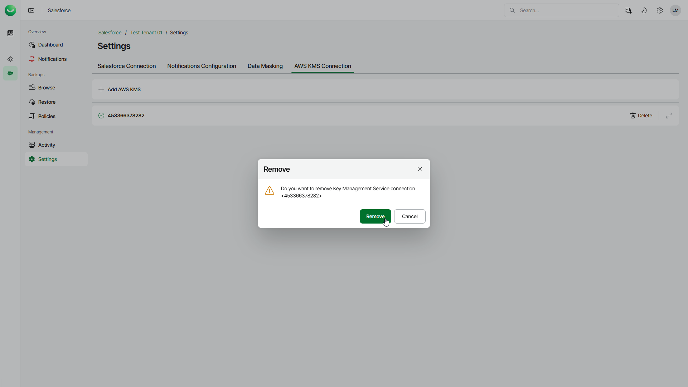

# Removing AWS KMS Connections

Veeam Data Cloud allows you to remove a connection to AWS KMS if you no longer need it. You cannot remove a connection to AWS KMS whose key is currently used by any backup policy to encrypt data. Before you remove the connection, edit the backup policy settings to choose another encryption key. For details, see [Editing Backup Policies](sf_backup_policies_edit.md).

To remove a connection, do the following:

1. On the Salesforce page, click the name of the tenant you want to manage.
2. Select Settings.
3. Select the AWS KMS Connection tab.
4. Click Delete next to the AWS Key Management Service connection that you want to remove.
5. Click Remove to confirm the deletion.

