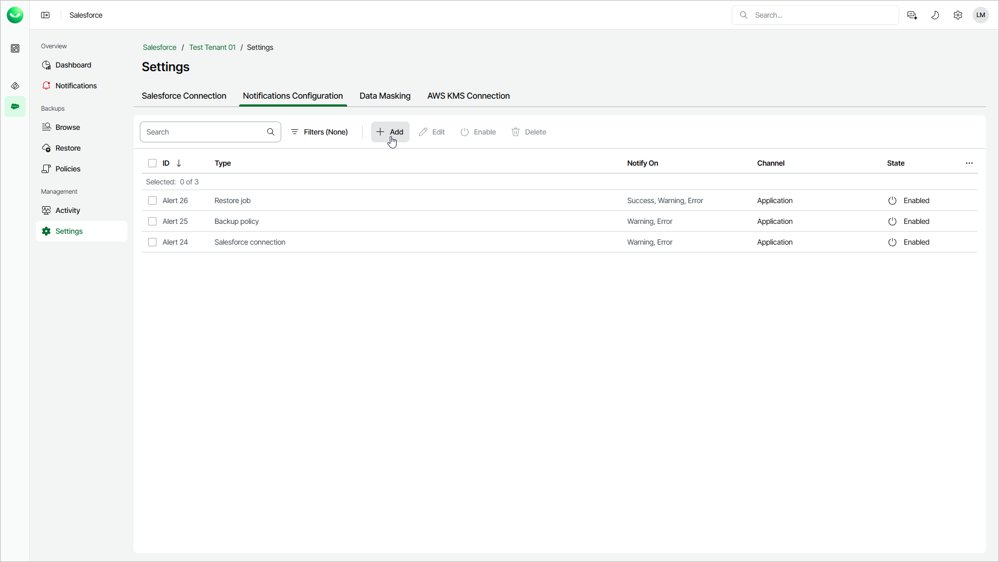

# Step 1. Launch Add Notification Wizard

In this article

To launch the Add Notification wizard, do the following:

1. On the Salesforce page, click the name of the tenant you want to manage.
2. Select Settings.
3. Select the Notifications Configuration tab.
4. Click Add.

Page updated 10/17/2025
