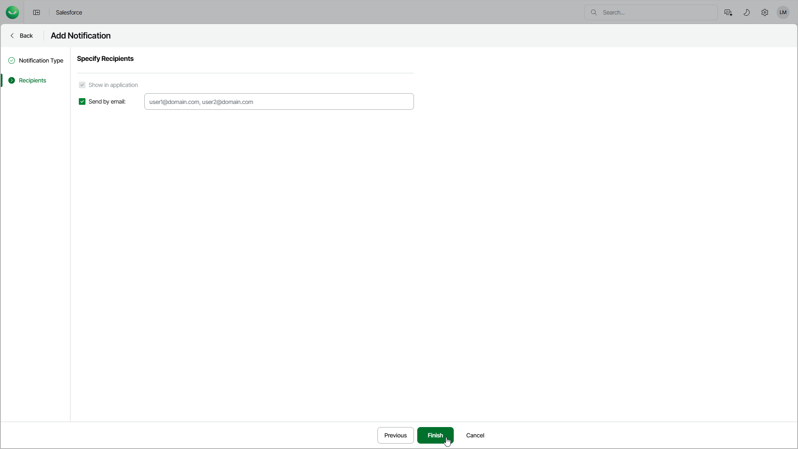

# Step 3. Specify Notification Recipients

In this article

At the Recipients step of the wizard, you can specify a list of email addresses that will receive messages with this notification. By default, Veeam Data Cloud only displays notifications in the Notification and Dashboard sections for all users that have access to your Salesforce tenant.

To add email recipients for the notification, select Send by email and specify recipient email addresses separated by a comma and whitespace.

Page updated 8/22/2025
