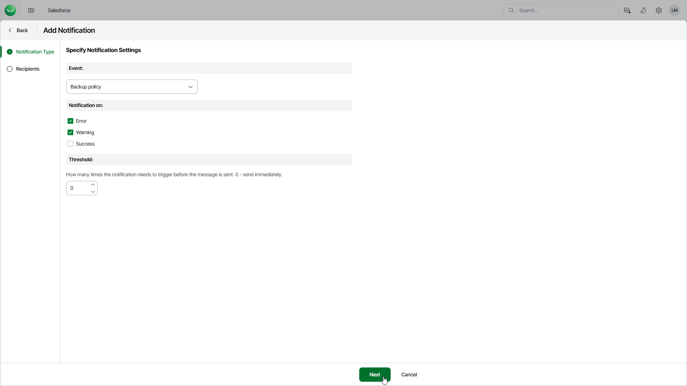

# Step 2. Specify Notification Settings

In this article

At the Notification Type step of the wizard, specify the following settings:

1. From the Event drop-down list, select the type of events for which you want to create the notification.

If you select the Data change event type, you must also choose objects that will be monitored to trigger the notification. To do this, click the link in the Select Objects field. Then, in the Select Objects window, select objects from the list.

The list displays only the objects that have been added to the backup policy that protects the Salesforce tenant. For details, see [Configure Additional Options](sf_backup_policies_edit_backup_options.md). If the list does not contain the required object, the object is excluded from the backup policy.

1. In the Notification on section, specify conditions under which Veeam Data Cloud will trigger this notification.
2. In the Threshold section, specify how many times the notification must be triggered before Veeam Data Cloud sends a message. For example, set 0 to send the message when the notification is triggered for the first time or set 5, and the product will send the message only upon the 6th event.

Page updated 8/22/2025
