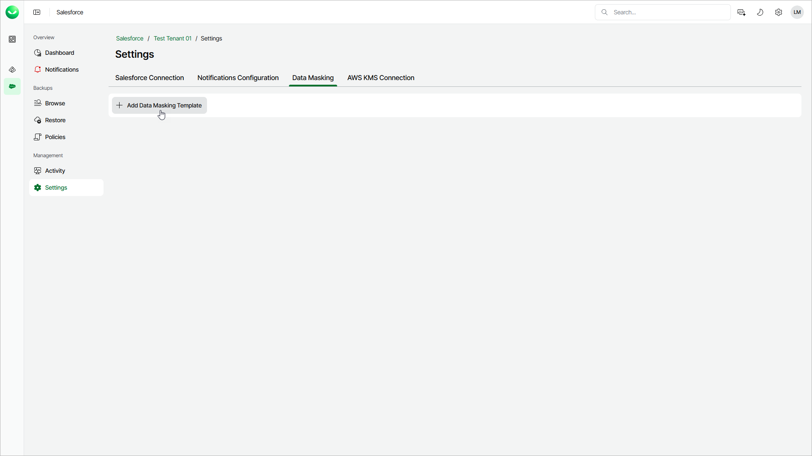

# Step 1. Launch Add Data Masking Template Wizard

To launch the Add Data Masking Template wizard, do the following:

1. On the Salesforce page, click the name of the tenant you want to manage.
2. Select Settings.
3. Select the Data Masking tab.
4. Click Add Data Masking Template.

