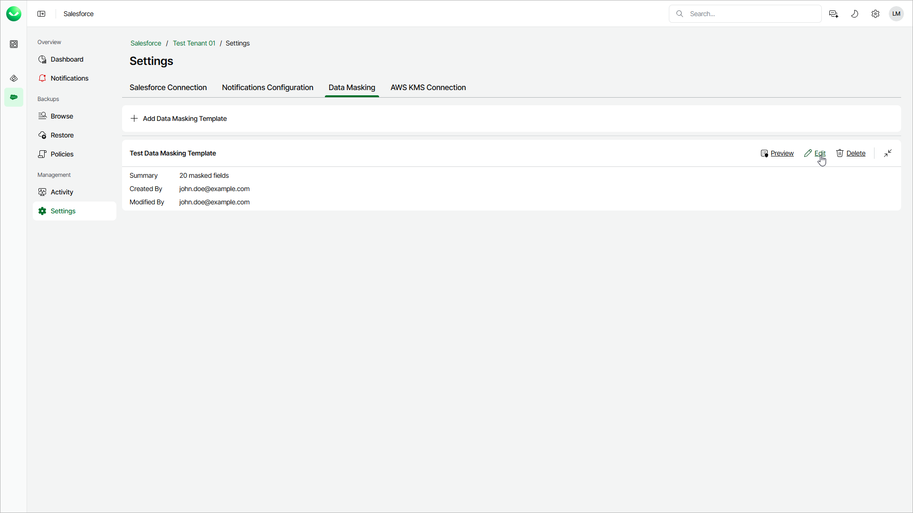

# Editing Data Masking Templates

You may need to edit a data masking template to change the name of the template and to adjust the masking rules.

To edit a data masking template, use the Edit Data Masking Template wizard:

1. On the Salesforce page, click the name of the tenant you want to manage.
2. Select Settings.
3. Select the Data Masking tab.
4. Click Edit next to the template you want to edit.
5. To complete the Edit Data Masking Template wizard, follow the instructions starting at the [Specify Template Name](sf_settings_templates_add_name.md) step of the Adding Data Masking Templates section.

