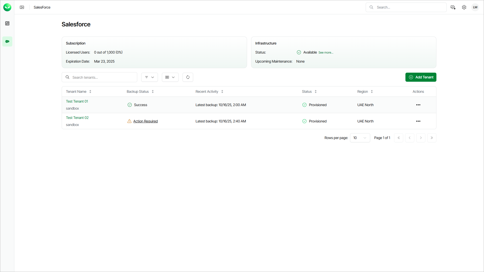

# Viewing Salesforce Tenants

On the Salesforce page, you can view all added Salesforce tenants and information on the Veeam Data Cloud for Salesforce subscription and Veeam Data Cloud maintenance. You can also add a new Salesforce tenant. For details, see [Adding Salesforce Tenants](sf_tenants_add.md).

To view the Salesforce page, select Salesforce on the left.

In the upper section, Veeam Data Cloud displays the following information:

* The Licensed users field shows how many licenses are available in your subscription.
* The Expiration Date field shows when your subscription will expire. For details on Veeam Data Cloud for Salesforce licensing, see [Licensing](sf_licensing.md).
* The Status field shows the current status of the Veeam Data Cloud infrastructure. To view the status of regions where your Salesforce tenants are deployed, click See more next to the Status field.
* The Upcoming Maintenance field provides information on the next planned maintenance date. To view all upcoming maintenance that can affect your Salesforce tenants, click See more next to the Upcoming Maintenance field.

Tenant Properties

In the tenant list, Veeam Data Cloud displays the following properties for each tenant:

| Property | Description |
| --- | --- |
| Tenant Name | Name that you specified when adding the tenant and the type of the tenant (Production, Salesforce Trial, Sandbox, Developer). |
| Salesforce User | Salesforce user that Veeam Data Cloud uses to connect to your Salesforce tenant. |
| Salesforce ID | ID of your Salesforce tenant. |
| Salesforce URL | Salesforce URL that you specified when adding the tenant. |
| Backup Status | Current state of the Salesforce tenant backup. For details, see [Backup Statuses](#backupstatuses). |
| Recent Activity | Date and time when Veeam Data Cloud started the last backup of the tenant. |
| Status | Current state of the Salesforce tenant. For details, see [Tenant Statuses](#tenantstatuses). |
| Users | Number of users with Salesforce license that are in your Salesforce tenant. |
| Platform Users | Number of users with Salesforce Platform license that are in your Salesforce tenant. |
| Create Date | Time and date when the tenant was added to Veeam Data Cloud. |
| Created By | Veeam Data Cloud user who added this tenant. |
| Region | Region where Veeam Data Cloud stores your backed-up data. For information on supported Microsoft Azure regions, see [Backup Storage Regions](sf_regions.md). |

Backup Statuses

Each Salesforce tenant can have one of the following backup statuses:

| Status | Description |
| --- | --- |
| Provisioning | Veeam Data Cloud is provisioning a new tenant after you finished the Add Salesforce tenant wizard. After the infrastructure for your tenant is ready, Veeam Data Cloud creates the initial backup of your Salesforce tenant. |
| In Progress | The infrastructure for your tenant is ready, the initial backup of your Salesforce tenant is in progress and you can manage your tenant. |
| Success | The backup policy is enabled. Status of the last backup session is Success or Warning. |
| Failed | The backup policy is enabled. Status of the last backup session is Failed. To find the reason why the backup failed, check the backup session logs. For details, see [Viewing Backup Sessions](sf_activity_backup.md). If you cannot resolve the issue by adjusting the backup policy, [submit a support case](https://my.veeam.com/my-cases). |
| Disabled | The backup policy is disabled. You can manage your Salesforce tenant and run restore and archival jobs. You can re-enable the backup policy. For details, see [Enabling and Disabling Backup Policies](sf_backup_policies_disable_enable.md). |
| Action Required | Veeam Data Cloud cannot connect to your Salesforce tenant due to one of the following reasons:   * The Salesforce connection token has expired and Veeam Data Cloud cannot provision your new Salesforce tenant or backup your existing Salesforce tenant. * The Salesforce session settings are not correct. For details on Salesforce session settings, see [Considerations and Limitations](sf_limitations.md#session).   To resolve the issue, click the status link and take the steps described in the Action Required window. |

Tenant Statuses

Each Salesforce tenant can have one of the following statuses:

| Status | Description |
| --- | --- |
| Provisioning | Veeam Data Cloud is provisioning a new tenant after you finished the Add Salesforce tenant wizard. After the infrastructure for your tenant is ready, Veeam Data Cloud creates the initial backup of your Salesforce tenant. |
| Provisioned | The infrastructure for your tenant is ready, and you can manage your tenant. With this status, tenant management may be temporarily unavailable due to the following reasons:   * The initial backup of your Salesforce tenant is in progress. You will receive an email notification once the initial backup is completed. * Planned maintenance is in progress. For details on Veeam Data Cloud planned maintenance, see [Veeam Data Cloud Maintenance](#vdcmaintenance). * You do not have permission to manage the tenant. To get the permission, an administrator of your Veeam Data Cloud organization must assign you the Salesforce:Administrator, Salesforce:BackupOperator, Salesforce:RestoreOperator, or Salesforce:Viewer role and add this tenant to the role scope. For details, see [Editing Users](users_edit.md). |
| Provisioning Failed | The infrastructure deployment or initialization of the backup policy was not successful. To resolve the issue, [submit a support case](https://my.veeam.com/my-cases). |
| Deprovisioning | Your subscription has expired and Veeam Data Cloud is suspending the backup policy in your tenant. After the backup policy is suspended, the tenant status changes to In Retention. |
| Deprovision Failed | Veeam Data Cloud was unable to suspend your backup policy. To resolve the issue, [submit a support case](https://my.veeam.com/my-cases). |
| In Retention | Your subscription has expired and Veeam Data Cloud suspended your backup policy. If you do not renew the subscription, Veeam Data Cloud will handle your tenants and backed-up data according to the Veeam Data Cloud service agreement. For more information, see [this Veeam article](https://www.veeam.com/legal/veeam-data-cloud-service-agreement.html). |
| Reactivating | Veeam Data Cloud is activating the backup policy after you renewed your expired subscription within the retention period. After the backup policy is activated, the tenant status changes to Provisioned. |
| Reactivate Failed | Reactivation of the backup policy in your tenant was not successful. To resolve the issue, [submit a support case](https://my.veeam.com/my-cases). |
| Deleting | The retention period has expired, and Veeam Data Cloud is removing your tenant and all related data. |
| Delete Failed | Deletion of your tenant was not successful. To resolve the issue, [submit a support case](https://my.veeam.com/my-cases). |

Veeam Data Cloud Maintenance

Maintenance in Veeam Data Cloud involves various tasks that are designed to keep the services secure, updated and running smoothly. During the maintenance time, operations (backups, restores, adding tenants, policy changes and so on) within the affected regions may be suspended. Depending on the type of maintenance task, a short downtime may be expected. To keep track of scheduled maintenance, a plan of upcoming maintenance is available.

To view upcoming maintenance for your Salesforce tenants, select Salesforce on the left. The Upcoming Maintenance field provides information on the next planned maintenance date. To view all upcoming maintenance that can affect your Salesforce tenants, click See more.

