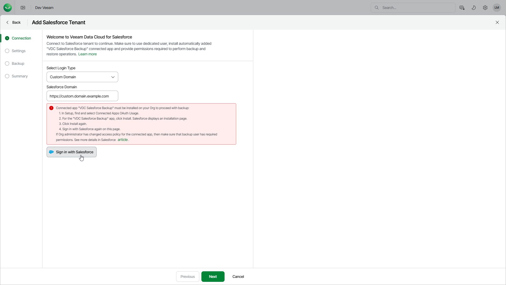

# Step 2. Connect to Salesforce Tenant

In this article

At the Connection step of the wizard, log in to the Salesforce tenant that you want to add and install a new connected app:

1. From the Login Type drop-down list, select the type of tenant you want to add:

* Select Production to add a production, developer or trial Salesforce tenant that uses the login.salesforce.com URL for authentication.
* Select Sandbox to add a sandbox Salesforce tenant that uses the test.salesforce.com URL for authentication.
* Select Custom to add a Salesforce tenant that uses a custom URL for authentication. Then, in the Salesforce Domain field, specify the Salesforce login URL you want to use.

1. Click Sign in with Salesforce. You will be redirected to the Salesforce authentication webpage.
2. On the Salesforce authentication webpage, enter credentials of a Salesforce user of the tenant that you want to add, and click Log in. After that, you will be redirected back.

The specified user must be assigned permissions required for Veeam Data Cloud to be able to perform backup and restore operations. For details, see [Permissions](sf_permissions.md).

You can change the Salesforce user later. You can also verify whether the user has sufficient permission to perform backup and restore operations. For details, see [Configuring Backup Service Connection](sf_settings_connections.md).

1. If you restrict login IP addresses in Salesforce user profiles, Veeam Data Cloud may request you to add a specific Veeam Data Cloud IP address to the allowed login IP ranges in your Salesforce tenant. The required IP address may be different for each Salesforce tenant you add. For more details on how to specify allowed IP ranges, see [Salesforce Documentation](https://help.salesforce.com/s/articleView?id=platform.login_ip_ranges.htm&type=5).

You may need to add another IP address when Veeam Data Cloud starts to provision your new tenant. If it is necessary to add another IP address, Veeam Data Cloud will assign the Action Required status to the tenant. For details, see [Viewing Salesforce Tenants](sf_tenant_view.md#tenantstatuses).

1. If the Salesforce tenant requires you to install the new connected app, Veeam Data Cloud will request you to do the following:

1. Open a new browser tab, sign in to the Salesforce tenant and install the new VDC Salesforce Backup connected app that Veeam Data Cloud created automatically. For details, see [Salesforce Documentation](https://help.salesforce.com/s/articleView?id=005132365&type=1).
2. Return to the Add Salesforce Tenant wizard and click Sign in with Salesforce. You will be redirected to the Salesforce authentication webpage.
3. On the Salesforce authentication webpage, enter the credentials of the Salesforce user again and click Log in. After that, you will be redirected back.

|  |
| --- |
| Note |
| * If the user you use to connect the Salesforce tenant does not have the Approve Uninstalled Connected Apps permission assigned, the Salesforce portal displays the OAuth error and prevents you from installing the connected app. To install the app, assign the user the Approve Uninstalled Connected Apps permission first. * For sandbox tenants, the Salesforce portal can also prevent you from installing the app if Salesforce licenses are mismatched. In this case, use the Match Production Licenses to Sandbox without a Refresh tool to resolve this issue. For details, see [Salesforce Documentation](https://help.salesforce.com/s/articleView?id=005132365&type=1#:~:text=Match%20Production%20Licenses). |

Page updated 12/11/2025
