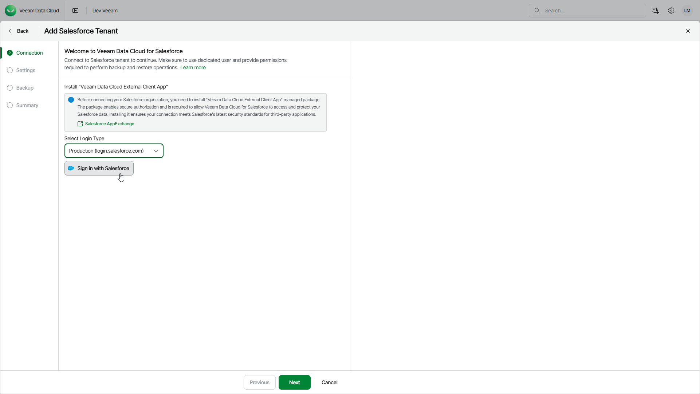

# Step 2. Connect to Salesforce Tenant

At the Connection step of the wizard, install the Veeam Data Cloud External Client App managed package and log in to the Salesforce tenant that you want to add:

1. Install the Veeam Data Cloud External Client App managed package:

1. Click Salesforce AppExchange to open the [Veeam Data Cloud External Client App page](https://redirect.veeam.com/helpvdcsftopicid%3D021).
2. Log in to the Salesforce AppExchange portal using credentials of a Salesforce Administrator account.
3. Click Get It Now.
4. On the Install Veeam Data Cloud External Client App page, select Install for Admins Only.
5. Select the I acknowledge check box and click Install.

1. From the Login Type drop-down list, select the type of tenant you want to add:

* Select Production to add a production, developer or trial Salesforce tenant that uses the login.salesforce.com URL for authentication.
* Select Sandbox to add a sandbox Salesforce tenant that uses the test.salesforce.com URL for authentication.
* Select Custom to add a Salesforce tenant that uses a custom URL for authentication. Then, in the Salesforce Domain field, specify the Salesforce login URL you want to use.

1. Click Sign in with Salesforce. You will be redirected to the Salesforce authentication webpage.
2. On the Salesforce authentication webpage, enter credentials of a Salesforce user of the tenant that you want to add, and click Log in. After that, you will be redirected back.

The specified user must be assigned permissions required for Veeam Data Cloud to be able to perform backup and restore operations. For details, see [Permissions](sf_permissions.md).

You can change the Salesforce user later. You can also verify whether the user has sufficient permission to perform backup and restore operations. For details, see [Configuring Backup Service Connection](sf_settings_connections.md).

1. If you restrict login IP addresses in Salesforce user profiles, Veeam Data Cloud may request you to add a specific Veeam Data Cloud IP address to the allowed login IP ranges in your Salesforce tenant. The required IP address may be different for each Salesforce tenant you add. For more details on how to specify allowed IP ranges, see [Salesforce Documentation](https://help.salesforce.com/s/articleView?id=platform.login_ip_ranges.htm&type=5).

You may need to add another IP address when Veeam Data Cloud starts to provision your new tenant. If it is necessary to add another IP address, Veeam Data Cloud will assign the Action Required status to the tenant. For details, see [Viewing Salesforce Tenants](sf_tenant_view.md#tenantstatuses).

