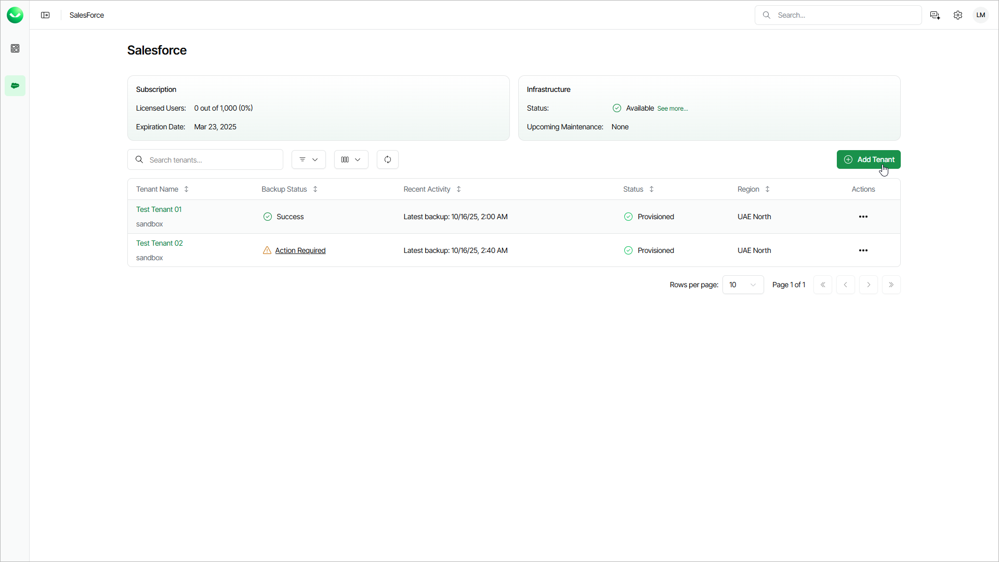

# Step 1. Launch Add Salesforce Tenant Wizard

In this article

To launch the Add Salesforce Tenant wizard, do the following:

1. To open the list of Salesforce tenants, click Salesforce on the left.
2. Click Add Tenant.

|  |
| --- |
| Note |
| If you are a customer of a Veeam Cloud & Service Provider partner, you cannot launch the Add Salesforce tenant wizard. Ask your service provider to add your Salesforce tenant or send you an email with an invitation link that allows you to launch the wizard. |

Page updated 12/4/2025
