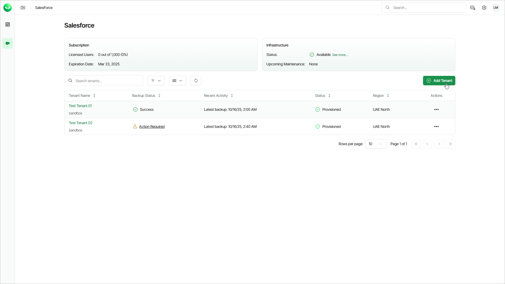

# Step 1. Launch Add Salesforce Tenant Wizard

To launch the Add Salesforce Tenant wizard, do the following:

1. To open the list of Salesforce tenants, click Salesforce on the left.
2. Click Add Tenant.

|  |
| --- |
| Note |
| If you are a customer of a Veeam Cloud & Service Provider partner, you cannot launch the Add Salesforce tenant wizard. Ask your service provider to add your Salesforce tenant or send you an email with an invitation link that allows you to launch the wizard. |

|  |
| --- |
| Tip |
| If you add a sandbox Salesforce tenant that was previously backed up with Veeam Data Cloud and later refreshed in Salesforce, the existing backup is deleted and the tenant is added as new. To keep the existing backup and only refresh the connection token for the sandbox tenant, [submit a support case](https://my.veeam.com/my-cases). |

