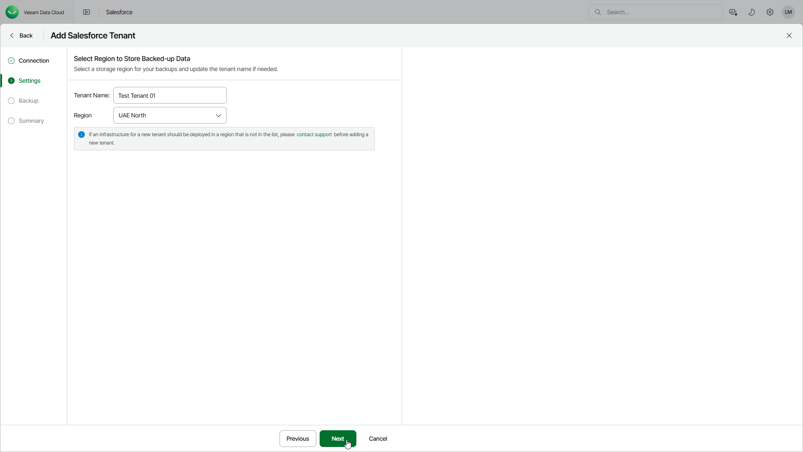

# Step 3. Specify Tenant Settings

In this article

At the Settings step of the wizard, specify the following settings:

1. In the Tenant Name field, specify a display name for the new tenant.
2. Select a Microsoft Azure region where the backup infrastructure and storage will be provisioned. The process differs depending on whether you are adding the first Salesforce tenant.

* If you are adding the first Salesforce tenant, select a region from the Region drop-down list.
* If you are adding another Salesforce tenant, Veeam Data Cloud uses the region that you specified for your first Salesforce tenant. If you need to use a different region, before you add the tenant, contact [Veeam Customer Support](https://my.veeam.com/my-cases).

For information on supported Microsoft Azure regions, see [Backup Storage Regions](sf_regions.md).

Page updated 8/6/2025
