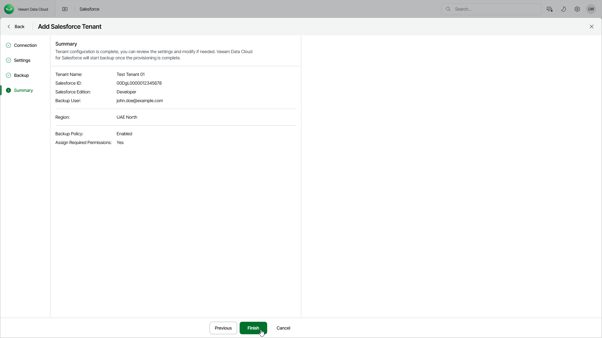

# Step 5. Finish Working with Wizard

In this article

At the Summary step of the wizard, review your settings and click Finish to start provisioning the new Salesforce tenant. Provisioning the first Salesforce tenant in the selected Microsoft Azure region may last up to 10 minutes. You will receive an email notification once provisioning is completed.

Page updated 3/21/2025
