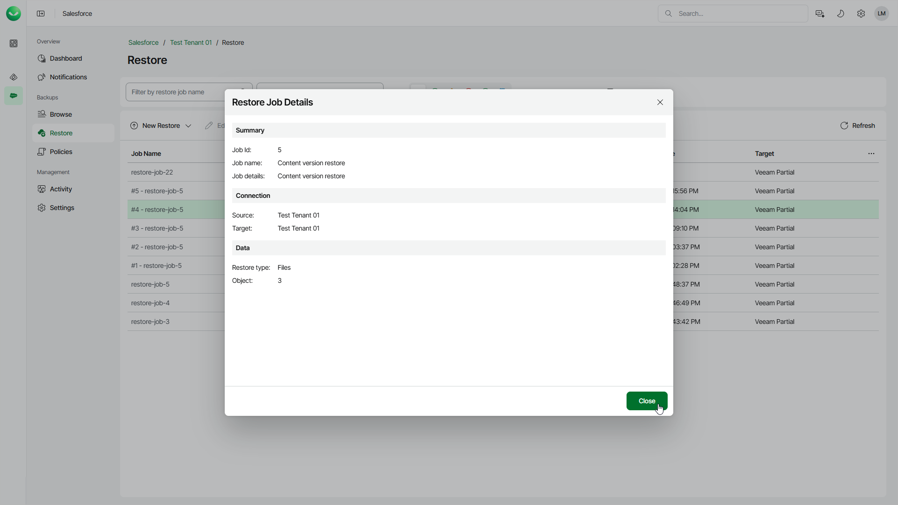

# Viewing Restore Job Details

Veeam Data Cloud displays all restore jobs and restore job drafts on the Restore tab. After you run a restore session, it cannot be edited or removed.

To view settings configured for a specific restore job, do the following:

1. On the Salesforce page, click the name of the tenant you want to manage.
2. To view all restore jobs created for the tenant, select Restore on the left.
3. Select the necessary job.
4. Click View Details.

You can also view restore session statistics in the Activity section. For details, see [Viewing Restore Sessions](sf_activity_restore.md).

