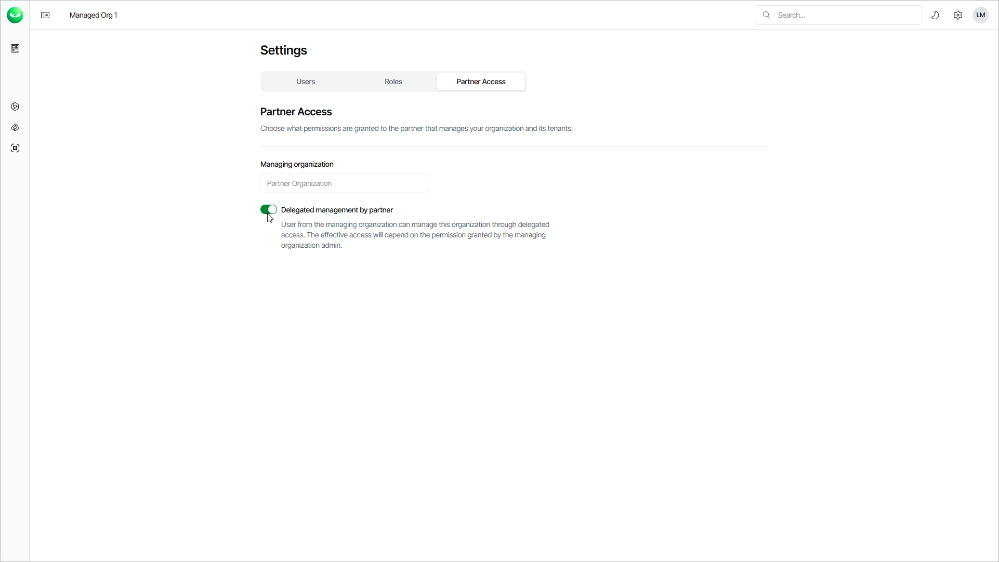

# Configuring Partner Access

In this article

If you are a customer of a Veeam Cloud & Service Provider partner, you can choose whether to allow the partner to manage Veeam Data Cloud users, work with backup policies and restores and configure tenant settings in your Veeam Data Cloud organization. Regardless of this setting, the partner can always add tenants and invite you to add tenants to your Veeam Data Cloud organization.

To configure the partner access for your organization:

1. Click the settings icon in the top-right corner.
2. Select Partner Access.
3. Set the Delegated management by partner toggle to On to allow the partner to manage your organization. Set the toggle to Off to prevent the partner from managing your organization.

Page updated 10/21/2025
