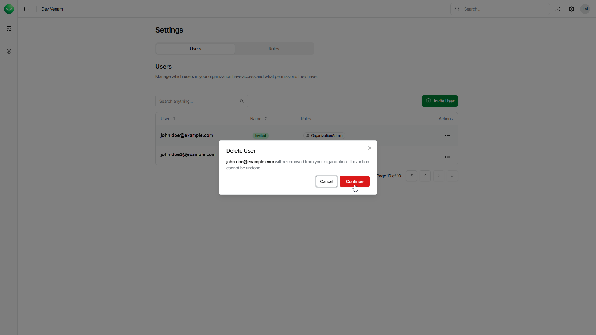

# Deleting Users

You can delete a user account if you no longer need it.

To delete a user, do the following:

1. Click the settings icon in the top-right corner.
2. Select Users.
3. On the Users tab, in the Actions column of the required user, click the menu icon and select Delete.
4. Click Continue to confirm the deletion.

