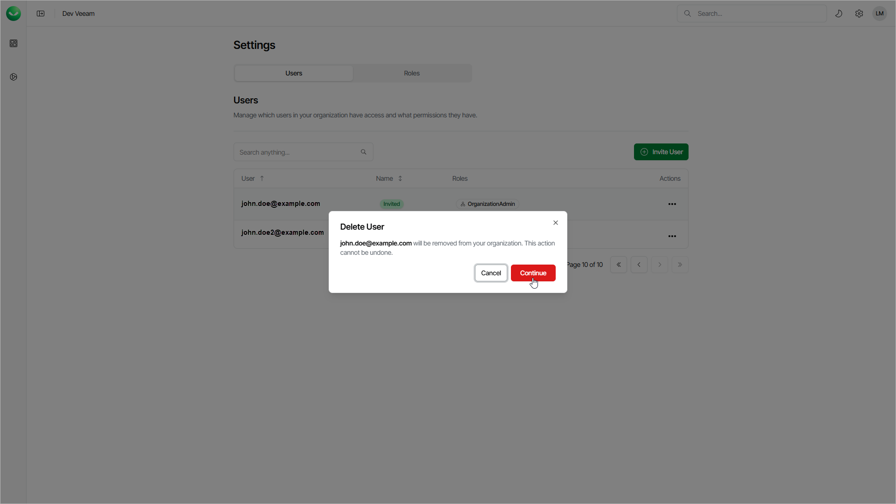

# Deleting Users

You can delete a user account if you no longer need it.

To delete a user, do the following:

1. Click the settings icon in the top-right corner.
2. Select Users.
3. On the Users tab, in the Actions column of the required user, click the menu icon and select Delete.
4. Click Continue to confirm the deletion.

|  |
| --- |
| Note |
| If you delete a user account from Veeam Data Cloud and the user remains a group member, Veeam Data Cloud will create the user account again when the user attempts to log in to Veeam Data Cloud. For details, see [Groups](users_groups.md). |

