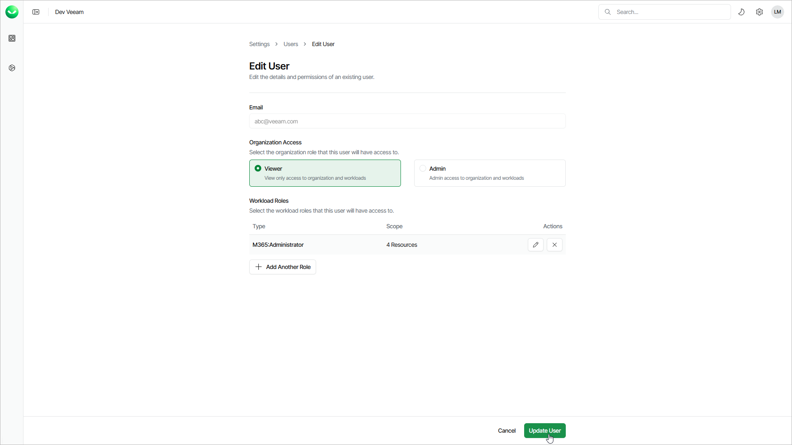

# Editing Users

In this article

You may need to edit a user to adjust assigned roles and role scopes. Note that you cannot edit the user that you are currently logged in to Veeam Data Cloud.

|  |
| --- |
| Note |
| Each Veeam Data Cloud user must have at least one of the organization-level roles assigned: OrganizationAdmin or OrganizationViewer. For details, see [Roles](users_roles.md). |

To edit a user, do the following:

1. Click the settings icon in the top-right corner.
2. Select Users.
3. On the Users tab, in the Actions column of the required user, click the menu icon and select Edit.
4. In the Edit User window, do the following:

1. In the Organization Access section, select Viewer to assign the user the OrganizationViewer role or select Admin to assign the user the OrganizationAdmin role.

* If you select Viewer, you can assign additional roles to allow the user to work with workload tenants.
* If you select Admin, you cannot assign additional roles. This role gives the user access to all workloads and tenants. The user can manage users and perform all configuration actions, backup and restore operations.

1. If you selected Viewer, click Add Another Role to assign a role that allows the user to work with tenants.
2. In the Add Role window, do the following:

1. From the Role drop-down list, select a role you want to assign to the user.
2. Specify a role scope.

You can apply the role to all current and future workload tenants or select tenants to which the selected role will be applied. For details on role access rights, see [Roles](users_roles.md).

1. For the selected workload tenants scope, you can choose groups of users and SharePoint sites to include in the role scope.

This feature is currently only available for Microsoft 365 workloads.

1. Click Save Changes.
2. If you want to edit an assigned role, click the edit icon next to the role you want to edit.
3. In the Edit Role window, change the role or the role scope and click Save Changes.
4. If you want to remove an assigned role, click the remove icon next to the role you want to remove.

1. Click Update User to save the changes.

Page updated 10/1/2025
