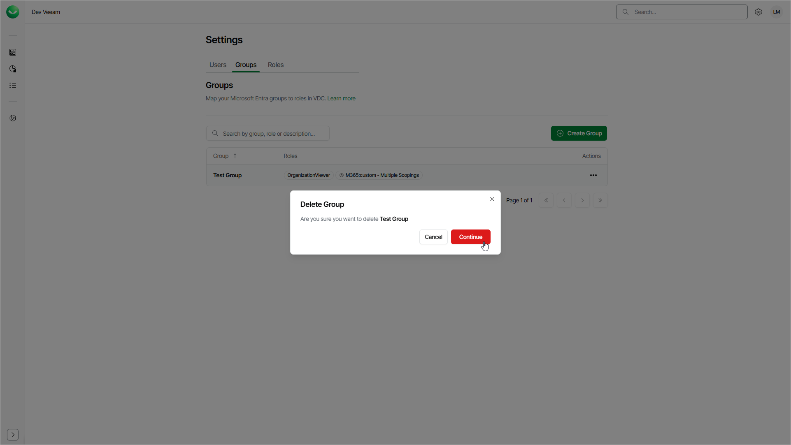

# Deleting Groups

You can delete a group if you no longer need it. After you delete the group, Veeam Data Cloud can no longer use this group to authenticate the group members that log in to Veeam Data Cloud for the first time and to assign them roles.

The group management is available only if you are signed in to Veeam Data Cloud using a Microsoft Entra ID account and you have the OrganizationAdmin role assigned. If you are signed in with Veeam My Account credentials, the group management options are not available.

To delete a group, do the following:

1. Click the settings icon in the top-right corner.
2. Select Groups.
3. On the Groups tab, in the Actions column of the required group, click the menu icon and select Delete.
4. Click Continue to confirm the deletion.

