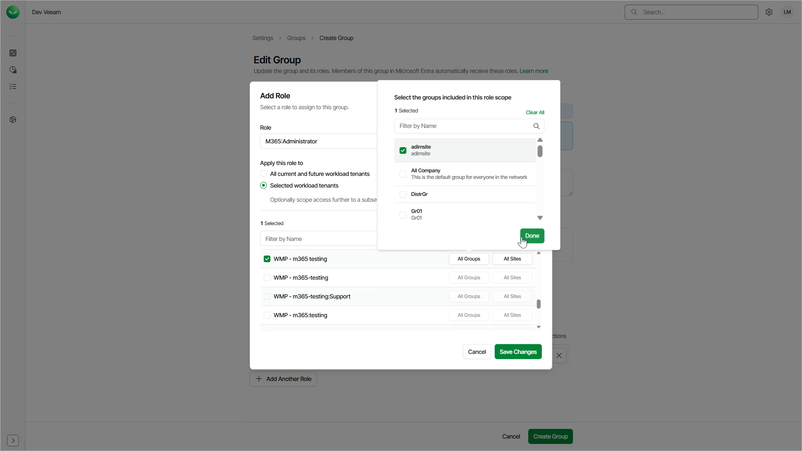
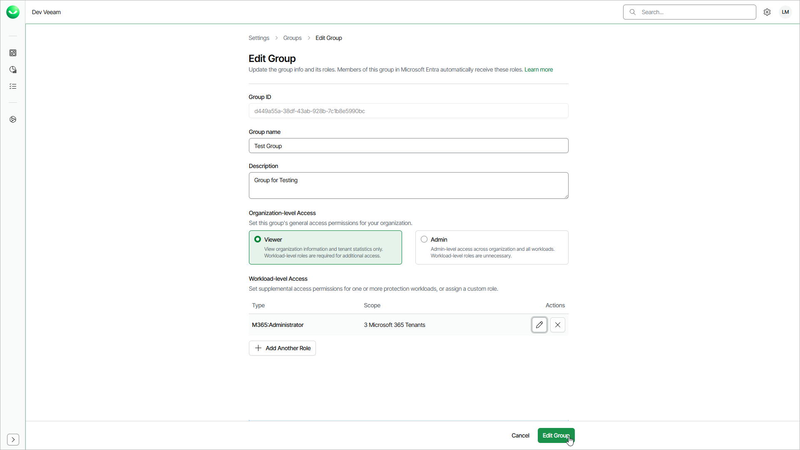

# Editing Groups

You may need to edit a group to adjust assigned roles and role scopes or to rename the group to match the name of the group in Microsoft Entra ID. To add or remove group members, use the Microsoft Entra ID portal.

To edit a group, follow these steps:

1. Click the settings icon in the top-right corner.
2. Select Groups.
3. On the Groups tab, in the Actions column of the required group, click the menu icon and select Edit.
4. In the Edit Group window, specify the following group details:

1. In the Group name field, edit the name of the group.
2. In the Description field, enter a description for your reference.
3. In the Organization Access section, select Viewer to assign the group the OrganizationViewer role or select Admin to assign the group the OrganizationAdmin role. Note that at least one organization-level role must be assigned to the group.

* If you select Viewer, you can assign additional roles to allow the group members to work with workload tenants.
* If you select Admin, you cannot assign additional roles. This role grants access to all workloads and tenants. The group members can manage users and perform all configuration actions, backup and restore operations.

1. In the Description field, enter a description for your reference.
2. If you selected Viewer, click Add Role to assign a role that allows the group members to work with tenants.
3. In the Add Role window, do the following:

1. From the Role drop-down list, select a role you want to assign to the group.
2. Specify a role scope.

You can apply the role to all current and future workload tenants or select tenants to which the selected role will be applied. For details on role access rights, see [Roles](users_roles.md).

1. For the selected workload tenants scope, you can choose groups of users and SharePoint sites to include in the role scope.

This feature is currently only available for Microsoft 365 workloads.

1. Click Save Changes.
2. If you want to assign another role, click Add Another Role.

1. To complete the process, click Edit Group.

