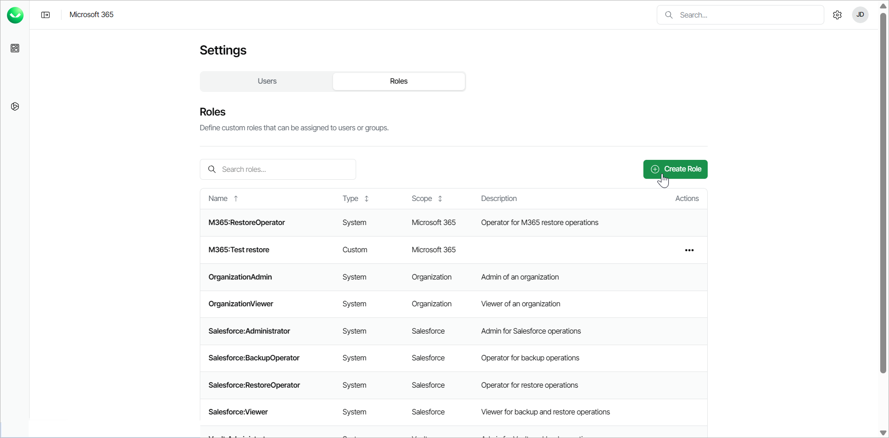
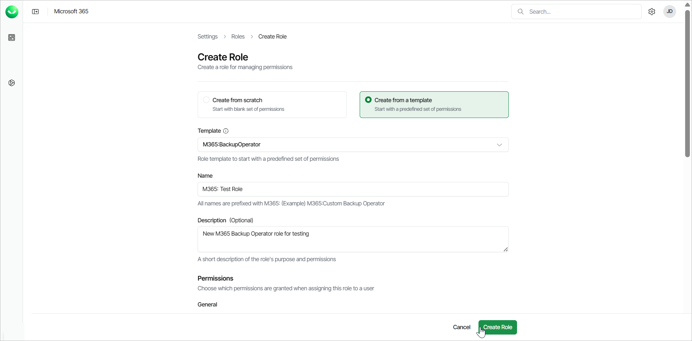

# Creating Roles

Users with the OrganizationAdmin role can create custom roles with custom permissions. Organization administrators can then control what the users in the organization can access and what actions they can perform.

|  |
| --- |
| NOTE |
| At the moment, custom roles are supported only for the Microsoft 365 workload. |

Creating Roles

To create a new role, do the following:

1. Click the settings icon in the top-right corner.
2. On the Roles tab, click Create Role.

1. Select one of the following options:

* Select Create from scratch to create a new role.

In the Workload field, select the workload for the new role. At the moment, the M365 workload is preselected, as it is the only one available.

* Select Create from a template to use one of the built-in templates for the new role.

From the Template drop-down list, select one of the built-in templates. Each template has a set of permissions assigned to it. You can add or remove permissions in the Permissions section.

1. In the Name field, specify a name for the new role. The name must have the prefix of the workload. For example, for Microsoft 365, M365: Custom Restore Operator.
2. [Optional] In the Description field, provide a description of the role for future reference.
3. In the Permissions section, select the check boxes next to the permissions you want to assign to the role.
4. Click Create Role.

Microsoft 365 Role Templates

Veeam Data Cloud for Microsoft 365 offers the following 3 user role templates when you create a new role:

* M365:Administrator — can add and manage tenants and perform all configuration actions and backup and restore operations. All the available permissions are assigned to this role template.
* M365:BackupOperator — can add and manage tenants and create and manage backup policies. The permissions assigned to this role template are the following:

* List Tenants
* View Tenants
* Manage Tenants
* Onboard Tenants
* View Backups
* Manage Backups

* M365:RestoreOperator — can view tenants and perform restore operations. The permissions assigned to this role template are the following:

* List Tenants
* View Tenants
* All SharePoint, Teams and OneDrive permissions
* All Outlook permissions except for Preview Emails
* Perform M365 Bulk Restore (for users under the Premium plan)

Microsoft 365 Role Permissions

The following table lists the available permissions that you can assign to a user role for the Microsoft 365 workload:

| Permission | Description |
| --- | --- |
| General | |
| List Tenants | View the list of all existing workload tenants in Microsoft 365. |
| View Tenants | Enter the tenant view. |
| Manage Tenants | Manage system settings within the Microsoft 365 tenant. |
| Onboard Tenants | Create new workload tenants. |
| View Activity Logs | View Microsoft 365 tenant activity logs. |
| View Licensing Dashboard | View the dashboard widgets that contain Microsoft 365 licensing information. |
| Manage Reports | Manage, execute and view reports within the tenant. |
| Manage Notification Settings | Manage notification settings within the tenant. |
| Backup | |
| View Backups | View Microsoft 365 backup policies and associated session logs. |
| Manage Backups | Create and manage backup policies. |
| SharePoint | |
| Browse Restore Points | Browse SharePoint restore points. |
| Restore To Original Location | Restore SharePoint items to the original location. |
| Restore To Different Location | Restore SharePoint items to a different location. |
| Download | Download SharePoint items to a local machine. |
| Teams | |
| Browse Restore Points | Browse Teams restore points. |
| Restore To Original Location | Restore Teams items to the original location. |
| OneDrive | |
| Browse Restore Points | Browse OneDrive restore points. |
| Restore To Original Location | Restore OneDrive items to the original location. |
| Restore To Different Location | Restore OneDrive items to a different location. |
| Download | Download OneDrive items to a local machine. |
| Outlook | |
| Browse Restore Points | Browse Outlook restore points. |
| Preview Emails | Preview Outlook emails. |
| Restore To Original Location | Restore Outlook items to the original location. |
| Restore To Different Location | Restore Outlook items to a different location. |
| Download | Download Outlook items to a local machine. |
| Express Plan | |
| Perform M365 Bulk Restore | Perform bulk restore (available only under the Premium plan). |

