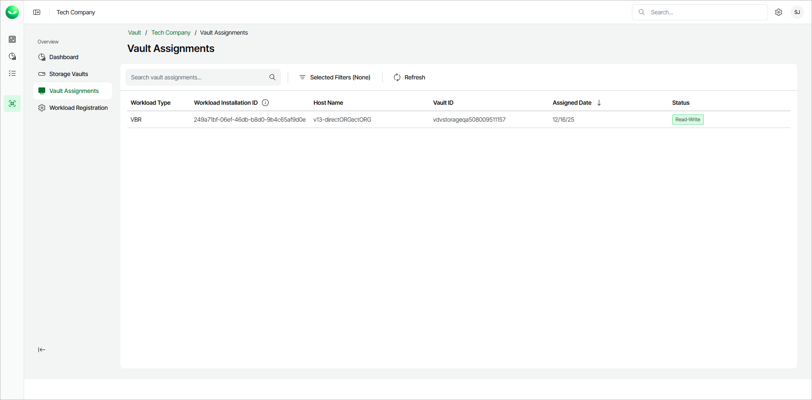

# Viewing Vault Assignments

In this article

Veeam Data Cloud Vault allows you to view information about Veeam Backup & Replication integrations and Veeam Kasten integrations.

To view a list of integrations, do the following:

1. On the Vault page, find the necessary tenant in the list of tenants. Click the button with three dots at the end of the row, then click Manage.
2. In the left menu, click Vault Assignments.
3. On the Vault Assignments page, view the list of integrations.

For each item in the list, Veeam Data Cloud displays the following parameters:

* Workload Type

You can filter integrations by selecting the workload type from the drop-down list. You can select to see KASTEN (for Veeam Kasten integrations) or VBR (for Veeam Backup & Replication integrations) workload type. When the filter is active, a funnel icon appears next to the column name.

The Vault Assignments page displays integrations for Azure editions of Veeam Data Cloud Vault only.

* Workload Installation ID

Unique identifier assigned to the specific workload.

* Host Name

Host name of the workload. In case of integration with Veeam Backup & Replication, the value of this parameter is the host name of the Veeam Backup & Replication server.

* Vault ID

Unique identifier of the specific storage vault.

* Assigned Date

The date is specified in the following format: mm/dd/yyyy. You can sort the list by date. To do that, click on the arrow next to the column name. If the arrow is pointing down, the most recent integrations are displayed at the top of the list. If the arrow points up, the oldest integrations are displayed at the top.

* Status

You can filter integrations by selecting the status from the drop-down list. You can select to see Read-Write or Read-Only status. When the filter is active, a funnel icon appears next to the column name.

Page updated 12/16/2025
