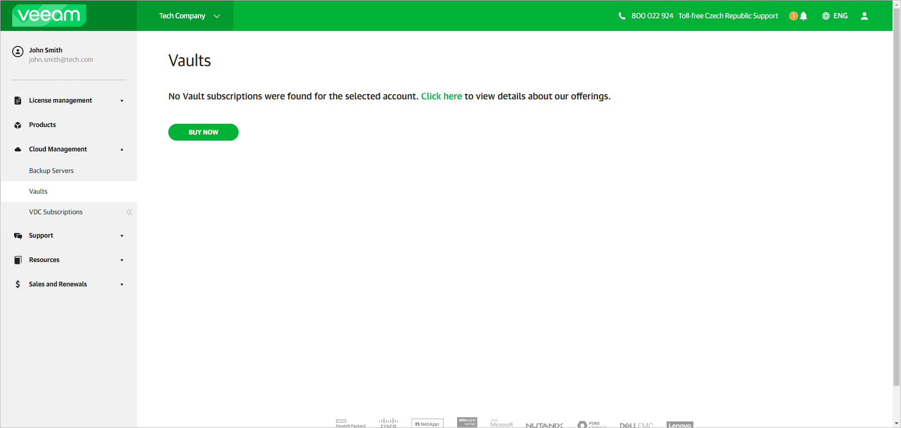

# Managing Veeam Data Cloud Vault Subscriptions

In this article

To let users manage Veeam Data Cloud Vault subscriptions, Veeam offers a centralized tool, the My Account portal. You must obtain a subscription and create at least one storage vault in this subscription to start using Veeam Data Cloud Vault with Veeam Backup & Replication. You can perform these operations in advance or after you initiate the process of connecting the products as described in [Connecting Veeam Data Cloud Vault with Veeam Backup & Replication](vault_vbr.md).

To obtain a Veeam Data Cloud Vault subscription, do the following:

1. Log in to the Veeam My Account portal.
2. In the main menu, click Cloud Management > Vaults.
3. If your organization has no Veeam Data Cloud Vault subscriptions, the Vaults page will display a message about this along with a link to the Veeam Data Cloud Vault product page on the Veeam website. Click Buy Now and follow the steps on the Veeam website to obtain a subscription.

|  |
| --- |
| Tip |
| You can add more subscriptions later, if necessary. To do this, navigate to the Vaults page once again. The page will display a list of subscriptions in your organization. Click Buy More to obtain a new subscription. |

Page updated 12/18/2025
