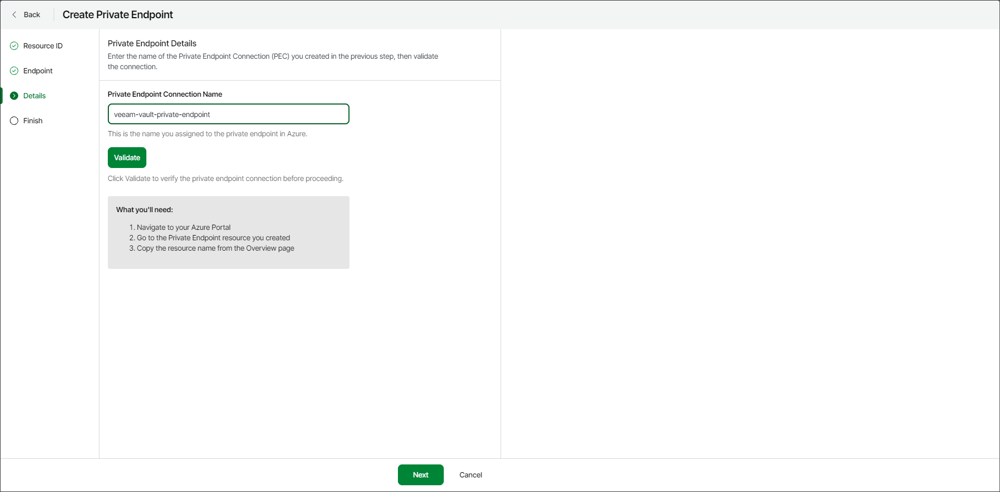

# Step 4. Validate Private Endpoint Connection

At the Details step of the wizard, insert the name of the private endpoint connection and click the Validate button.

As a name of the private endpoint connection, use the private endpoint resource name you specified in Azure portal. You can find the name of the private endpoint resource in the Private endpoints section on the network foundation page in the Azure portal.

