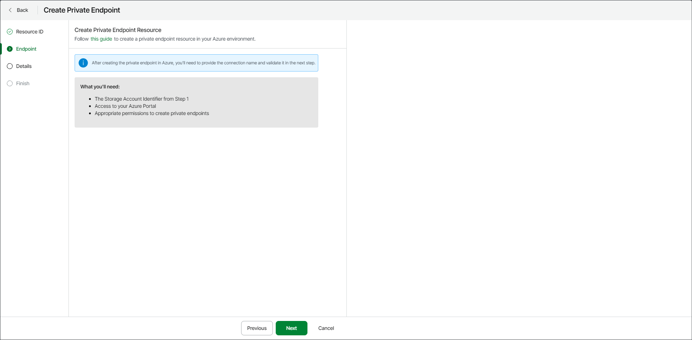

# Step 3. Create Private Endpoint Resource

At the Endpoint step of the wizard, click this guide and follow the instructions to create a private endpoint resource in the Azure portal.

For information on how to create a private endpoint by using the Azure portal, see [Microsoft Docs](https://learn.microsoft.com/en-us/azure/private-link/create-private-endpoint-portal?tabs=dynamic-ip).

