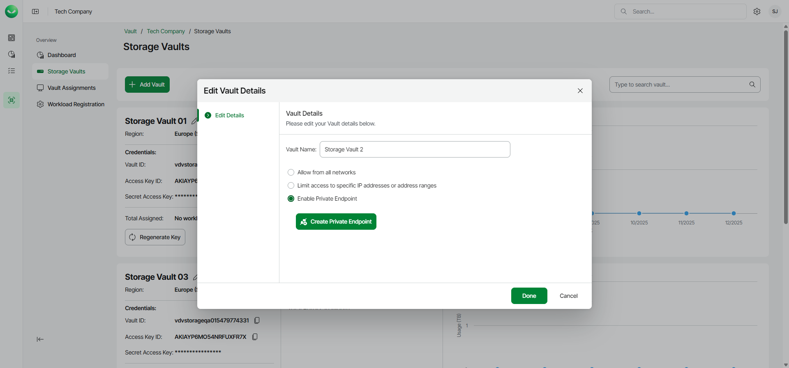

# Step 1. Launch Create Private Endpoint Wizard

To launch the Create Private Endpoint wizard, do the following:

1. On the Vault page, find the necessary tenant in the list of tenants and click the tenant name. Alternatively, click the menu icon at the end of the row and click Manage.
2. In the left menu, click Storage Vaults.
3. On the Storage Vaults page, locate the storage vault for which you want to create the private endpoint.
4. Click the edit icon next to the storage vault name.
5. In the Edit Vault Details window, do the following:

1. Select the Enable Private Endpoint option.
2. Click the Create Private Endpoint button.

