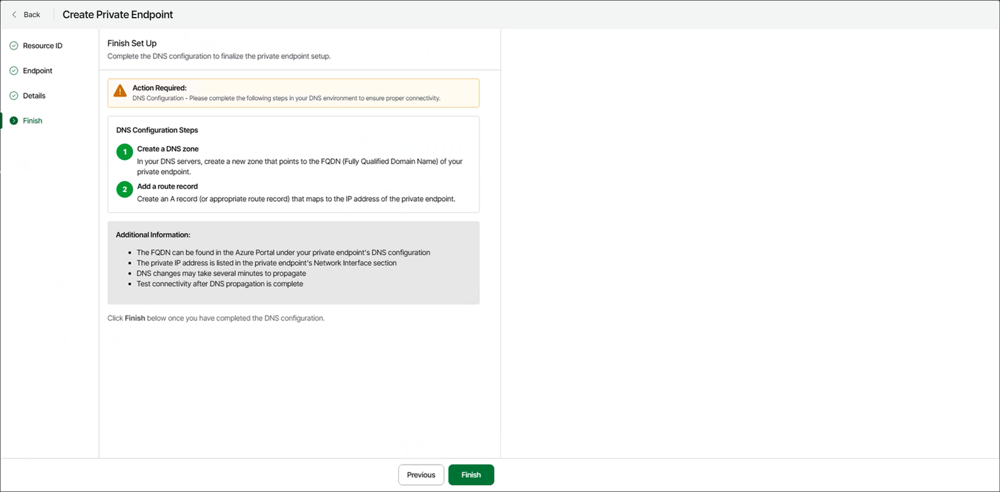

# Step 5. Finalize Private Endpoint Setup

At the Finish step of the wizard, follow the instructions to finalize the private endpoint setup.

1. In your DNS environment, complete the following configuration steps:

1. Create a DNS zone.

On your DNS server, create a new zone that matches the Fully Qualified Domain Name (FQDN) of your Azure private endpoint.

You can find the FQDN in the Azure portal under your private endpoint's configuration. To open the DNS configuration settings in the Azure portal, select the specific endpoint in the Private endpoints section on the network foundation page.

1. Add a route record.

Within the new DNS zone, add an A record (or the appropriate type for your setup) that maps the FQDN to the IP address of the private endpoint.

You can find the private IP address for your private endpoint in the Network interfaces section on the network foundation page in the Azure portal.

1. Allow DNS propagation.

DNS changes may take several minutes to propagate throughout your environment.

1. Test connectivity to the private endpoint using its FQDN.

1. Click Finish.

Veeam Data Cloud Vault will connect the storage vault to the private endpoint, and you will return to the Storage Vaults page.

