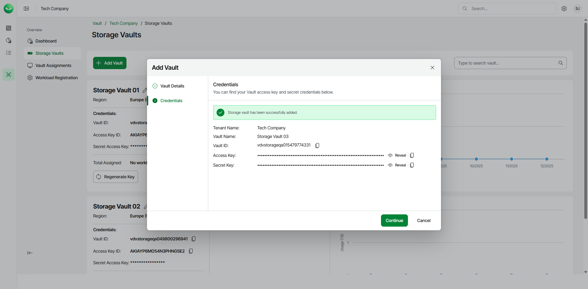

# Adding Storage Vaults for AWS Edition

To add a storage vault for an AWS Veeam Data Cloud Vault edition, do the following:

1. On the Vault page, find the necessary tenant in the list of tenants. Click the menu icon, then click Manage.
2. In the left menu, click Storage Vaults.
3. On the Storage Vaults page, click Add Vault.
4. In the Add Vault wizard, at the Vault Details step, do the following:

1. In the Vault Name field, specify the name for the new storage vault. The name must be between 3 and 50 characters in length.
2. From the Country drop-down list, select the country where you want to create the new storage vault.
3. [For the Advanced Core and Advanced Non-Core editions] From the Region drop-down list, select your preferred storage region. This helps you specify a location for your data more precisely in case multiple data centers in different regions are available within the country you selected.
4. Click Next. Veeam Data Cloud Vault will create the storage vault and display the storage vault credentials at the next step of the wizard.

1. At the Credentials step of the wizard, Veeam Data Cloud Vault will display the access key and secret key required to access the storage vault. You can use these keys to add Veeam Data Cloud Vault as an object storage repository in Veeam Backup & Replication.

Copy the access key and storage key and save them for future use. Once you finish working with the Add Vault wizard, you will not be able to view and copy the secret key, and will need to regenerate it, if necessary. For more information, see [Managing Storage Vaults](vault_storage_vaults_edit.md).

1. To view the keys, click Reveal next to the values in the Access Key and Secret Key fields.
2. To copy the keys, click the copy icon next to the values in the Access Key and Secret Key fields.

1. Click Continue to return to the Vault page.

|  |
| --- |
| Note |
| To use a storage vault of an AWS edition of Veeam Data Cloud Vault as an object storage repository in Veeam Backup & Replication, you must use the Vault ID as the name of the object storage repository. For more information on how to use Veeam Data Cloud Vault with Veeam Backup & Replication, see [Veeam Data Cloud Vault AWS Editions](vault_vbr_integration.md#vault_vbr_integration_aws). |

