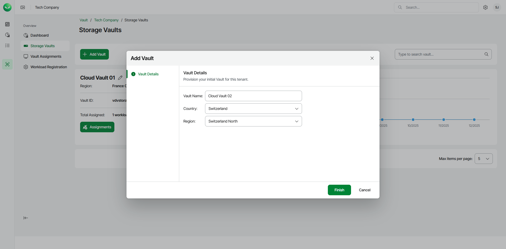

# Adding Storage Vaults for Azure Edition

To add a storage vault for an Azure Veeam Data Cloud Vault edition, do the following:

1. On the Vault page, find the necessary tenant in the list of tenants. Click the menu icon, then click Manage.
2. In the left menu, click Storage Vaults.
3. On the Storage Vaults page, click Add Vault.
4. In the Add Vault wizard, at the Vault Details step, do the following:

1. In the Vault Name field, specify the name for the new storage vault. The name must be between 3 and 50 characters in length.
2. From the Country drop-down list, select the country where you want to create the new storage vault.
3. [For the Advanced Core and Advanced Non-Core editions] From the Region drop-down list, select your preferred storage region. This helps you specify a location for your data more precisely in case multiple data centers in different regions are available within the country you selected.

1. Click Finish. Veeam Data Cloud Vault will create the storage vault.

1. Click Finish again to return to the Vault page.

