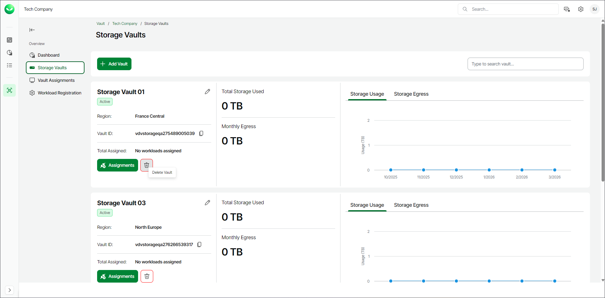
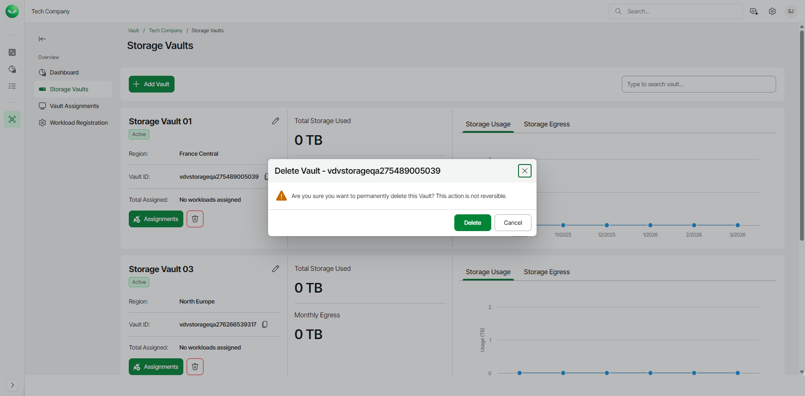

# Deleting Empty Storage Vaults

You can permanently delete an empty storage vault from the backup infrastructure.

Before you begin, make sure that the storage vault you want to delete allows access from all networks. You cannot delete storage vaults with limited access. For details on how to adjust the access settings of a storage vault, see [Editing Storage Vault Details](https://helpcenter.veeam.com/docs/vdc/userguide/vault_storage_vaults_edit.html#editing-storage-vault-details).

To delete the empty storage vault, do the following:

1. On the Vault page, find the necessary tenant in the list of tenants and click the tenant name. Alternatively, click the menu icon at the end of the row and click Manage.
2. In the left menu, click Storage Vaults.
3. On the Storage Vaults page, locate the storage vault you want to remove.
4. Click the Delete Vault.

1. In the Delete Vault window, click Delete to confirm the storage vault deletion.

|  |
| --- |
| Tip |
| To delete a storage vault that contains data, you must contact Veeam Customer Support. For details, see [Deleting Non-Empty Storage Vaults](vault_storage_vaults_delete_nonempty.md). |

