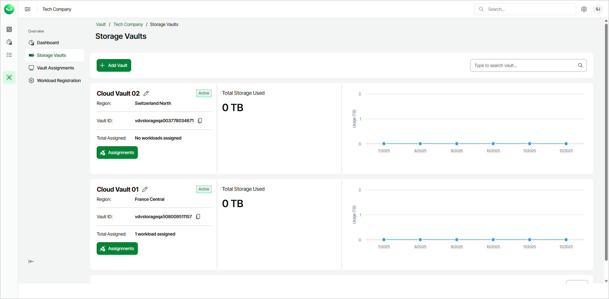
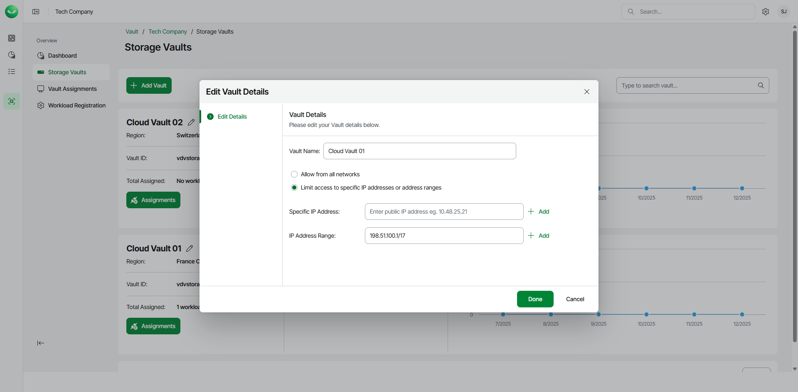
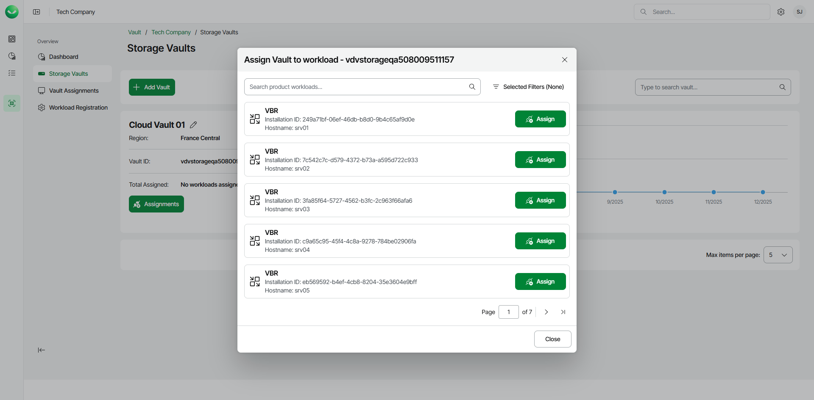
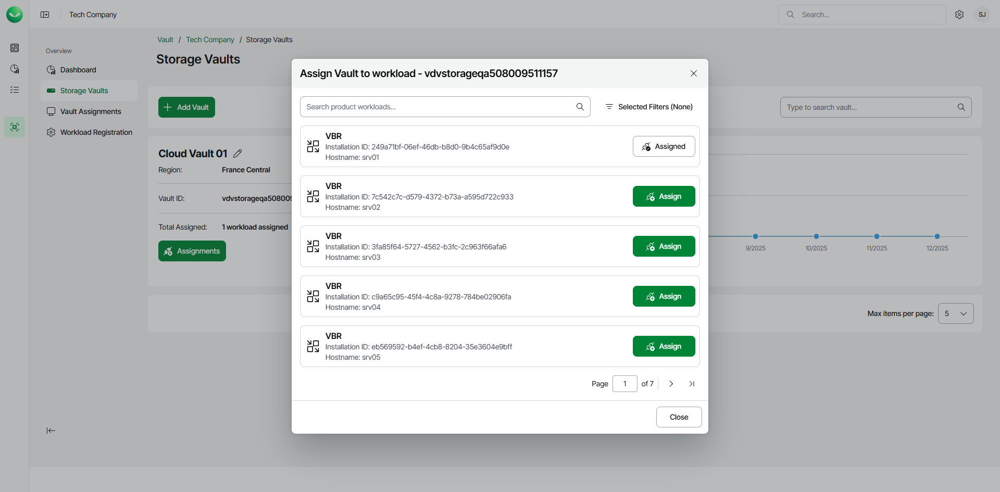
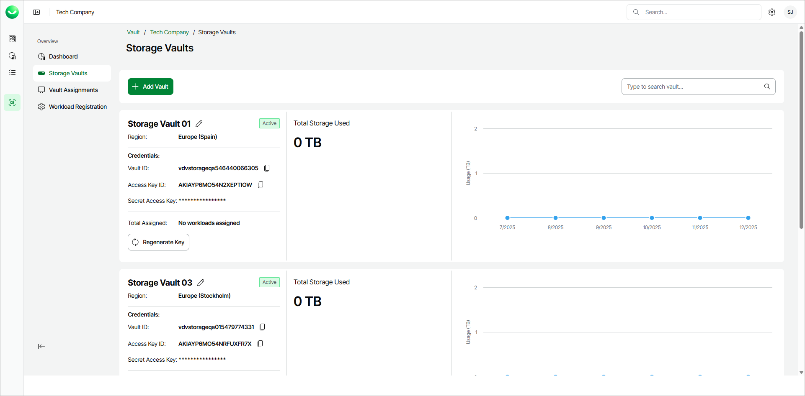
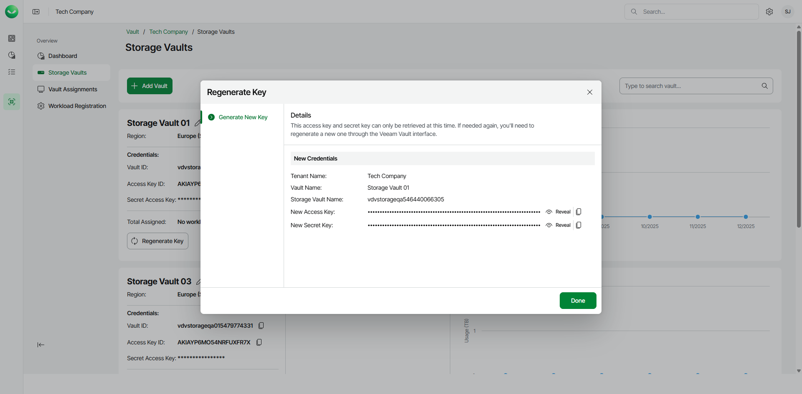

# Managing Storage Vaults

Veeam Data Cloud Vault provides detailed information about your storage vaults and allows you to edit vault names, configure sccess to storage vaults and assign storage vaults to workloads.

Viewing Storage Vault Details

To view the storage vault details, do the following:

1. On the Vault page, find the necessary tenant in the list of tenants and click the tenant name. Alternatively, click the button with three dots at the end of the row and click Manage.
2. In the left menu, click Storage Vaults.
3. On the Storage Vaults page, view storage vault details.

For each storage vault, Veeam Data Cloud displays the following information:

* The name of the storage vault.

You can change the storage vault name. For more information, see [Editing Storage Vault Details](#name).

* The status of the storage vault. To learn more about storage vault statuses, see [Deleting Storage Vaults](vault_storage_vaults_delete.md).
* The storage region that you selected when you added the storage vault.
* The ID of the storage vault.

To copy the storage vault ID, click the copy icon next to the value in the Vault ID field.

* The number of workloads assigned to the storage vault.
* [For AWS editions] Access key and secret key used to access the storage vault. You can use the keys to add the storage vault as an object storage repository in Veeam Backup & Replication.

To copy the access key, click the copy icon next to the value in the Access Key ID field.

To regenerate the secret key, click Regenerate Key and follow the steps . For more information, see [Regenerating Secret Key](#regenerate).

* The Total Storage Used counter that provides information about the total amount of storage used. Storage amount is specified in TB (TB is considered as 2^40 bytes).
* The graph that provides information about the total amount of storage used by the storage vault for the past 6 months. To view details for a specific month, move the cursor to a specific location on the graph.

Editing Storage Vault Details

To edit the storage vault details, do the following:

1. On the Vault page, find the necessary tenant in the list of tenants and click the tenant name. Alternatively, click the button with three dots at the end of the row and click Manage.
2. In the left menu, click Storage Vaults.
3. On the Storage Vaults page, locate the storage vault whose details you want to edit.

1. Click the edit icon next to the storage vault name.
2. In the Edit Vault Details window, in the Vault Name field, edit the name of the storage vault. The name must be between 3 and 50 characters in length.
3. If you want to adjust storage vault access, select one of the following options:

* Allow from all networks. Select this option to allow access from all IP addresses.
* Limit access to specific IP addresses or address ranges. Select this option to allow access to the storage vault only from specific IP addresses.

If you select this option, do either of the following:

* In the Specific IP Address field, specify the necessary IP address.

To add another field for more IP addresses, click the plus icon next and enter the IP address in the displayed field. Create a new field for each additional IP address.

* In the IP Address Range field, specify the first and the last IP address of the range.

To specify more than one IP address range, click the plus icon next and enter the IP addresses in the displayed field. Create a new field for each additional IP address range.

To specify the IP address range in a valid format, use the slash / punctuation mark. For example: 198.51.100.1/17.

|  |
| --- |
| Note |
| Settings that allow access only from specific IP addresses do not apply to connections that originate from Azure services in the same region as the storage vault region. For more information, see [Microsoft Docs](https://learn.microsoft.com/en-us/azure/storage/common/storage-network-security-limitations#restrictions-for-ip-network-rules). |

1. Click Done.

Assigning Storage Vaults to Workloads

You can assign a storage vault to a workload. In terms of Veeam Data Cloud Vault, a workload is an installation of a Veeam product that can use a storage vault as a backup target. By assigning a storage vault to a workload, you specify that the workload can create backups in this storage vault. This operation is required, for example, if you want to use a storage vault as an object storage repository in Veeam Backup & Replication or use a storage vault as a backup target for other supported Veeam products.

|  |
| --- |
| Note |
| If you use Veeam Data Cloud Vault with Veeam Backup & Replication, keep in mind that this operation is available for storage vaults in Azure editions of Veeam Data Cloud Vault and is not available in AWS editions. |

To assign a storage vault to a workload, do the following:

1. On the Vault page, in the list of tenants, click the name of the tenant whose storage vault you want to assign to a workload. Alternatively, in the Actions column of the list of tenants, click Manage next to the necessary tenant.
2. In the left menu, click Storage Vaults.
3. On the Storage Vaults page, locate the storage vault that you want to assign to a workload and click Assignments.
4. In the Assign Vault to workload window, click Assign next to the necessary workload.

To quickly find the necessary workload, you can use the search field of filter workloads by the workload type.

If you want to assign the storage vault to Veeam Backup & Replication, consider that the list of workloads contains Veeam Backup & Replication servers registered in Veeam Data Cloud as described in [Connecting Veeam Data Cloud Vault with Veeam Backup & Replication](vault_vbr.md), steps 1–3.

|  |
| --- |
| Tip |
| You can check the list of registered workloads at any time you need. For more information, see [Viewing Registered Workloads](vault_workloads.md). |

1. In the confirmation window, click Continue.

You can unassign the storage vault from the workload later, if needed. To do this, do the following:

1. On the Storage Vaults page, locate the storage vault that you want to unassign and click Assignments.
2. In the Assign Vault to workload window, click Assigned next to the necessary workload.
3. In the confirmation window, click Continue. The storage vault will become unavailable for use by the workload.

|  |
| --- |
| Note |
| After you disconnect a Veeam Backup & Replication server from a storage vault, the following applies:   * The connection to other Veeam Backup & Replication servers stays uninterrupted. * You can connect a new Veeam Backup & Replication server to the storage vault. |

Regenerating Access Key

If you use an AWS edition of Veeam Data Cloud Vault, you may want to regenerate the secret key for your storage vault. This may be helpful, for example, if you want to add the storage vault as an object storage repository in Veeam Backup & Replication, but have lost access to the storage vault credentials you saved for the future use when creating the storage vault.

To regenerate the key, complete the following steps:

1. In the left menu, click Storage Vaults.
2. On the Storage Vaults page, locate the storage vault whose secret key you want to regenerate.
3. In the Credentials section, click Regenerate Key.

1. In the Regenerate Key window, click Proceed to confirm that you want to regenerate the key.
2. Veeam Data Cloud Vault will regenerate the secret key and display the new access key and secret key at the Generate New Key step of the Regenerate Key wizard. You can use these keys to add the storage vault as an object storage repository in Veeam Backup & Replication.

1. To view the keys, click Reveal next to the values in the New Access Key and New Secret Key fields.
2. To copy the keys, click the copy icon next to the values in the New Access Key and New Secret Key fields.

1. Click Done to complete the operation.

