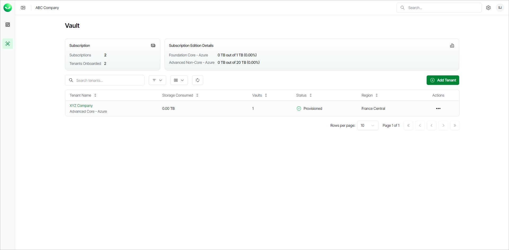
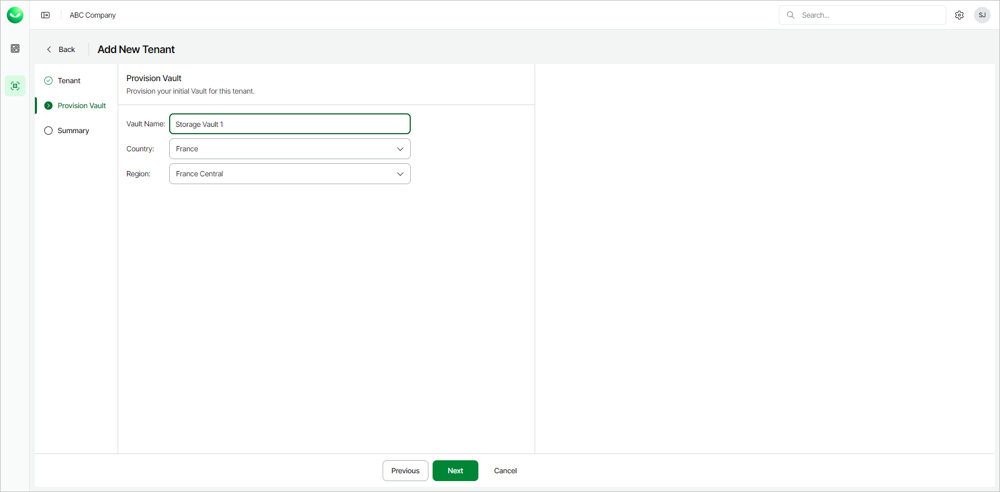
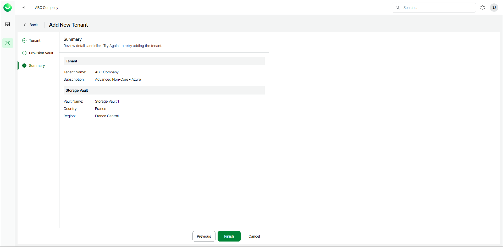

# Adding Veeam Data Cloud Vault Tenants with Azure Edition Subscriptions

To add a Veeam Data Cloud Vault tenant with an Azure edition subscription, do the following:

1. On the Vault page, click Add Tenant.

|  |
| --- |
| Note |
| If you are a customer of a Veeam Cloud & Service Provider partner, the Add New Tenant wizard is not available for direct use. Ask your service provider to add your Veeam Data Cloud Vault tenant or send you an email with an invitation link that allows you to launch the wizard. |

1. In the Add New Tenant wizard, at the Tenant step, do the following:

1. In the Tenant Name field, specify a name for the new tenant. The name must be between 2 and 50 characters in length.
2. From the Subscription drop-down list, select a Veeam Data Cloud Vault subscription.
3. Click Next.

1. At the Provision Vault step, do the following:

1. In the Vault Name field, specify the name for the new storage vault.
2. From the Country drop-down list, select the country where you want to create the new storage vault.
3. [For the Advanced Core and Advanced Non-Core editions] From the Region drop-down list, select your preferred storage region. This helps you specify location for your data more precisely in case multiple datacenters in different regions are available within the country that you selected.
4. Click Next.

1. At the Summary step, review details of the created tenant and storage vault.

1. Click Continue to return to the Vault page.

