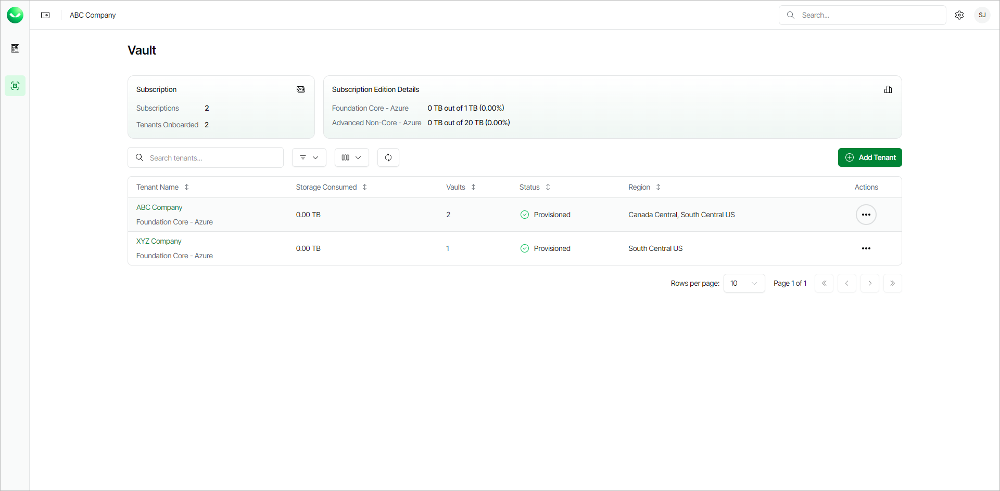
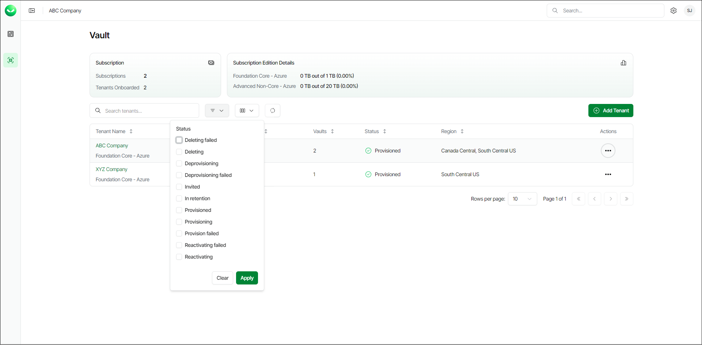

# Viewing Tenants

In this article

The Vault page provides access to the list of tenants you manage and displays information about each tenant.

To view the Vault page, select Vault on the left.

Viewing Tenants

On the Vault page, you can view tenant details.

The tenant widget displays the following details for each tenant:

* The Tenant Name column displays the name you assigned to the tenant.

The subscription edition that is used for the tenant is listed below the tenant name. To learn more, see [Veeam Data Cloud Vault Product Editions](vault_editions.md).

* The Storage Consumed column displays the amount of storage used by the tenant.
* The Vaults column displays vault storages available to the tenant.
* The Status column displays current status of the tenant account.
* The Region column displays locations selected while adding a tenant.

Working with Tenant List

On the Vault page, you can perform the following actions with the list of tenants:

* Search

Use the Search tenants field to search with tenant names.

* Filter

Click Filters to display only tenants with specific tenant status. Use check boxes to select the statuses.

* Refresh

Click Refresh to update the list of tenants and displayed details. The refresh action does not cancel the set filters.

* Sort

Use arrows next to the column name to sort the list of your tenants alphabetically by their names, subscriptions and storage regions.

Page updated 11/20/2025
