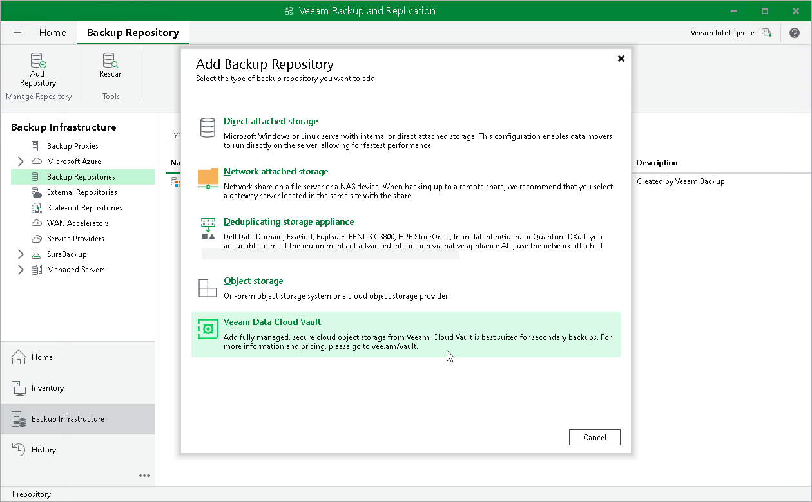
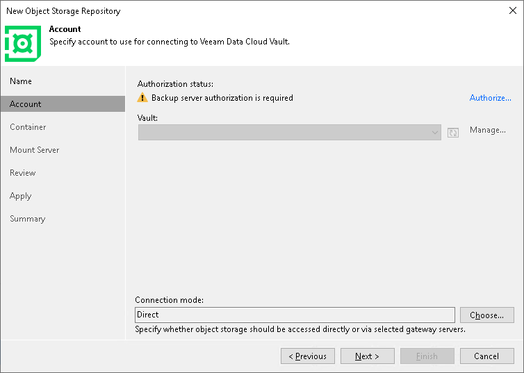

# Connecting Veeam Data Cloud Vault with Veeam Backup & Replication

You can use Veeam Data Cloud Vault as a target location for backups created by Veeam Backup & Replication. To do this, you must add Veeam Data Cloud Vault as an object storage repository in Veeam Backup & Replication and configure a backup job targeted at this repository.

For the Azure editions of Veeam Data Cloud Vault, you do not need to obtain credentials for a storage vault and provide them when connecting to Veeam Data Cloud Vault in Veeam Backup & Replication. Instead, you follow the procedure of connecting the products. Once the procedure is completed, Veeam Backup & Replication uses a security certificate to connect to Veeam Data Cloud Vault and transfer backup data to the target location over a secure connection.

To connect Veeam Data Cloud Vault with Veeam Backup & Replication, do the following:

1. In the Veeam Backup & Replication console, launch the New Object Storage Repository wizard:

1. Open the Backup Infrastructure view.
2. In the inventory pane, click the Backup Repositories node and then click Add Repository on the ribbon.
3. In the Add Backup Repository window, select Veeam Data Cloud Vault.

1. At the Account step of the New Object Storage Repository wizard, click Authorize.

1. In the displayed window, enter credentials of the user account under which you access the Veeam My Account portal and click Log In. Typically, this is the account you use to log in to the Veeam website to download the Veeam Backup & Replication installation media or obtain the license.
2. Veeam will register the Veeam backup server on the My Account portal and in Veeam Data Cloud. In the Veeam Backup & Replication console, at the Account step of the New Object Storage Repository wizard, click Manage.

1. On the displayed webpage, log in to Veeam Data Cloud using credentials of a user account that belongs to your Veeam Data Cloud organization. If you are already logged in to Veeam Data Cloud, the Veeam Data Cloud customer portal will open without a prompt to log in..

|  |
| --- |
| Note |
| To connect Veeam Backup & Replication to Veeam Data Cloud Vault, you must obtain a Veeam Data Cloud Vault subscription and create at least one storage vault in this subscription.  If you do not have a subscription, you can obtain it on the Veeam website. For more information, see [Obtaining Subscription](vault_manage_subscriptions.md#create_subscription).  If you have not created a storage vault, create it in Veeam Data Cloud. For more information, see [Adding Storage Vaults](vault_storage_vaults_add.md). |

1. In Veeam Data Cloud, assign the storage vault that you want to use as an object storage repository to Veeam Backup & Replication. To do this, do the following:

1. In Veeam Data Cloud, on the Vault page, click the name of the tenant whose storage vault you want to assign to a workload.
2. In the left menu, click Storage Vaults.
3. On the Storage Vaults page, locate the storage vault that you want to assign to Veeam Backup & Replication and click Assignments.
4. In the Assign Vault to workload window, click Assign next to the necessary Veeam Backup & Replication server.
5. In the confirmation window, click Continue.

If you have more than one storage vault configured in Veeam Data Cloud Vault, repeat this step for all storage vaults you want to become available in Veeam Backup & Replication.

For more information, see [Assigning Storage Vaults to Workloads](vault_storage_vaults_edit.md#assign).

1. In the Veeam Backup & Replication console, at the Account step of the New Object Storage Repository wizard, click the refresh icon. The storage Vault will become available in Veeam Backup & Replication. You can select the storage vault from the Vault drop-down list.

1. Complete the steps of the New Object Storage Repository wizard to add the storage vault as an object storage repository in Veeam Backup & Replication. For more information, see the [Adding Veeam Data Cloud Vault](https://helpcenter.veeam.com/docs/vbr/userguide/osr_adding_veeam_data_cloud_vault.html?ver=13) section in the Veeam Backup & Replication User Guide.

