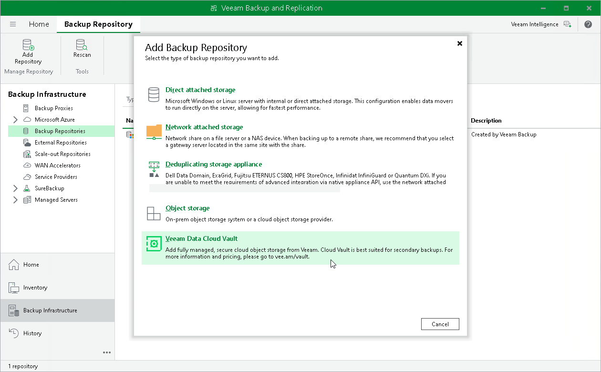
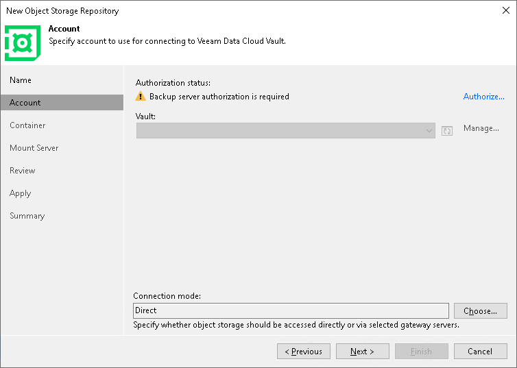
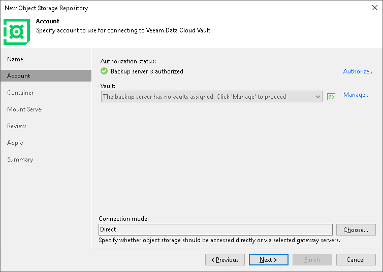
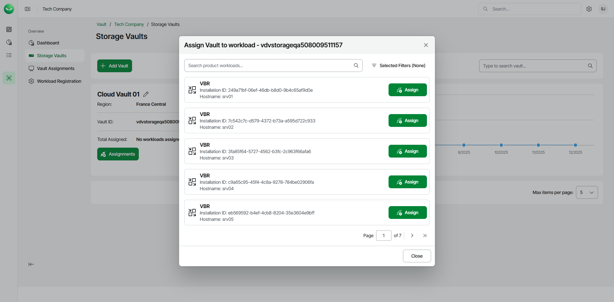
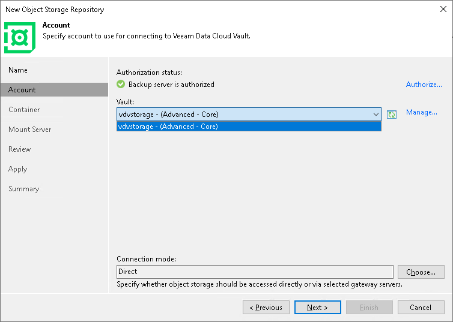

# Connecting Veeam Data Cloud Vault with Veeam Backup & Replication Using Console

You can use Veeam Data Cloud Vault as a target location for backups created by Veeam Backup & Replication. To do this, you must add a storage vault as an object storage repository in Veeam Backup & Replication and configure a backup job targeted at this repository.

For the Azure editions of Veeam Data Cloud Vault, you do not need to obtain credentials for the storage vault and provide them when connecting to Veeam Data Cloud Vault in Veeam Backup & Replication. Instead, you follow the procedure of connecting the products. Once the procedure is completed, Veeam Backup & Replication uses a security certificate to connect to Veeam Data Cloud Vault and transfer backup data to the target location over a secure connection.

|  |
| --- |
| Note |
| This section describes only the basic steps that you must take to connect Veeam Data Cloud Vault with Veeam Backup & Replication and start using Veeam Data Cloud Vault as an object storage repository in Veeam Backup & Replication. To get a detailed description of all Veeam Data Cloud Vault object storage repository settings, see the [Adding Veeam Data Cloud Vault Using Console](https://helpcenter.veeam.com/docs/vbr/userguide/vdcv_add_console.html?ver=13) section in the Veeam Backup & Replication User Guide. |

To connect Veeam Data Cloud Vault with Veeam Backup & Replication using the backup console, do the following:

1. In the Veeam Backup & Replication console, launch the New Object Storage Repository wizard:

1. Open the Backup Infrastructure view.
2. In the inventory pane, click the Backup Repositories node and then click Add Repository on the ribbon.
3. In the Add Backup Repository window, select Veeam Data Cloud Vault.

1. At the Account step of the New Object Storage Repository wizard, click Authorize.

1. In the Sign in to Veeam Customer Portal window, enter credentials of the user account under which you access Veeam Data Cloud and click Log In.

* In Veeam Backup & Replication earlier than build 13.0.1.2067, the account you use must have access to the Veeam My Account portal and Veeam Data Cloud. Veeam will register the backup server in Veeam My Account and in Veeam Data Cloud.
* In Veeam Backup & Replication build 13.0.1.2067 and later, the account you use does not need access to the Veeam My Account portal. Starting from this product version, Veeam Backup & Replication and Veeam Data Cloud Vault are connected directly, without using Veeam My Account. Veeam will register the backup server in Veeam Data Cloud.

|  |
| --- |
| Note |
| To connect Veeam Backup & Replication to Veeam Data Cloud Vault, you must obtain a Veeam Data Cloud Vault subscription and create at least one storage vault in this subscription.  If you do not have a subscription, you can obtain it on the Veeam website. For more information, see [Obtaining Veeam Data Cloud Vault](vault_obtain_product.md).  If you have not created a storage vault, create it in Veeam Data Cloud. For more information, see [Adding Storage Vaults](vault_storage_vaults_add.md). |

1. If you have only one storage vault that has not been assigned to any Veeam Backup & Replication server, Veeam Data Cloud Vault will automatically assign this storage vault to your backup server. At the Account step of the New Object Storage Repository wizard, the storage vault will be automatically selected in the Vault drop-down list.

Otherwise, click Manage next to the Vault drop-down list to assign a storage vault to the backup server in Veeam Data Cloud Vault.

1. On the displayed webpage, log in to Veeam Data Cloud using credentials of a user account that belongs to your Veeam Data Cloud organization. If you are already logged in to Veeam Data Cloud in your browser, the Veeam Data Cloud customer portal will open without a prompt to log in..
2. In Veeam Data Cloud, assign the storage vault that you want to use as an object storage repository to Veeam Backup & Replication. To do this, do the following:

1. In Veeam Data Cloud, on the Vault page, click the name of the tenant whose storage vault you want to assign to a workload.
2. In the left menu, click Storage Vaults.
3. On the Storage Vaults page, locate the storage vault that you want to assign to Veeam Backup & Replication and click Assignments.
4. In the Assign Vault to workload window, click Assign next to the necessary Veeam Backup & Replication server.
5. In the confirmation window, click Continue.

If you have more than one storage vault configured in Veeam Data Cloud Vault, repeat this step for all storage vaults you want to become available in Veeam Backup & Replication.

For more information, see [Assigning Storage Vaults to Workloads](vault_storage_vaults_edit.md#assign).

1. In the Veeam Backup & Replication console, at the Account step of the New Object Storage Repository wizard, click the refresh icon. The storage Vault will become available in Veeam Backup & Replication. You can select the storage vault from the Vault drop-down list.

1. Complete the steps of the New Object Storage Repository wizard to add the storage vault as an object storage repository in Veeam Backup & Replication.

For more information, see the [Adding Veeam Data Cloud Vault Using Console](https://helpcenter.veeam.com/docs/vbr/userguide/vdcv_add_console.html?ver=13) section in the Veeam Backup & Replication User Guide.

