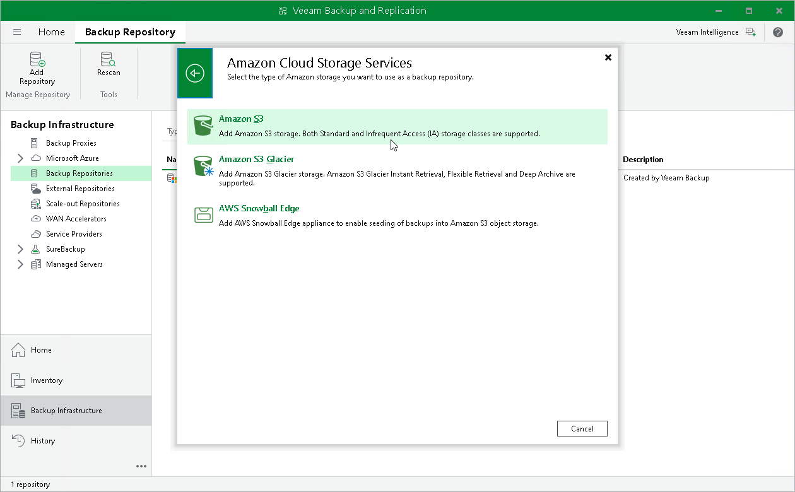

# Using Veeam Data Cloud Vault with Veeam Backup & Replication

You can use Veeam Data Cloud Vault as a target location for backups created by Veeam Backup & Replication. To do this, you must complete the following steps in Veeam Backup & Replication:

1. Add Veeam Data Cloud Vault as an object storage repository.
2. Configure a backup job targeted at this repository.

The procedure of adding Veeam Data Cloud Vault as an object storage repository differs depending on the Veeam Data Cloud Vault editions: Azure or AWS.

Veeam Data Cloud Vault Azure Editions

For the Azure editions of Veeam Data Cloud Vault, to add a storage vault as and object storage repository in Veeam Backup & Replication, you must use the Veeam Data Cloud Vault option to launch the New Object Storage Repository wizard, and then follow the steps of the wizard. At the Account step, follow the procedure to connect Veeam Data Cloud Vault with Veeam Backup & Replication.

For more information, see [Connecting Veeam Data Cloud Vault with Veeam Backup & Replication](vault_vbr.md).

Veeam Data Cloud Vault AWS Editions

For the AWS editions of Veeam Data Cloud Vault, to add a storage vault as an object storage repository in Veeam Backup & Replication, you must use the Amazon S3 option to launch the New Object Storage Repository wizard, and then follow the steps of the wizard. You do not need to connect Veeam Data Cloud Vault with Veeam Backup & Replication.

* At the Account step of the wizard, specify access key and storage key obtained when creating a storage vault.
* At the Bucket step of the wizard, do the following:

1. From the Data center drop-down list, select the storage region where the bucket is located.

To identify the storage region, view the storage vault details. To learn how to do that, see [Viewing Storage Vault Details](vault_storage_vaults_edit.md#view_vault).

1. In the Bucket field, specify Vault ID as a bucket name.
2. In the Folder field, select an existing folder or create a new one.
3. Select the Make backups immutable check box.
4. Specify the Infrequent Access Amazon S3 storage class.

For more information, see the following sections:

* [Adding Storage Vaults for AWS Edition](vault_storage_vaults_add_aws.md)
* [Viewing Storage Vault Details](vault_storage_vaults_edit.md#view_vault)
* [Adding Amazon S3 Storage](https://helpcenter.veeam.com/docs/vbr/userguide/osr_amazon_adding.html?ver=13) section in the Veeam Backup & Replication User Guide.

