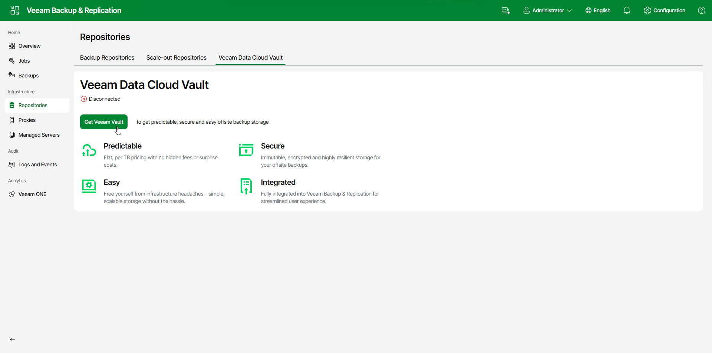
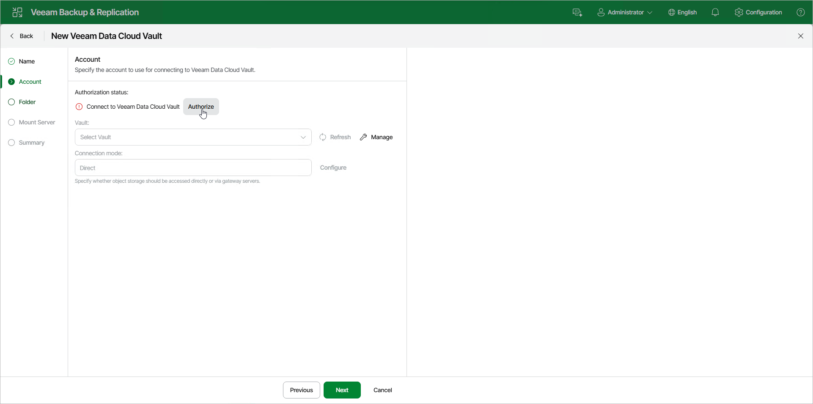
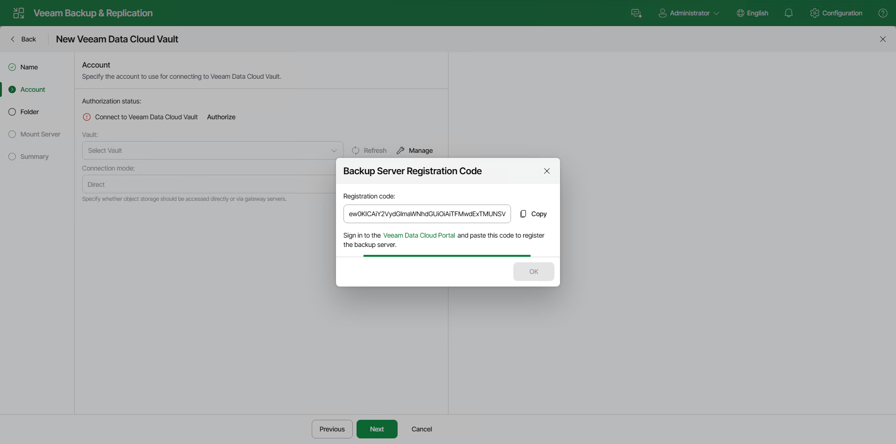
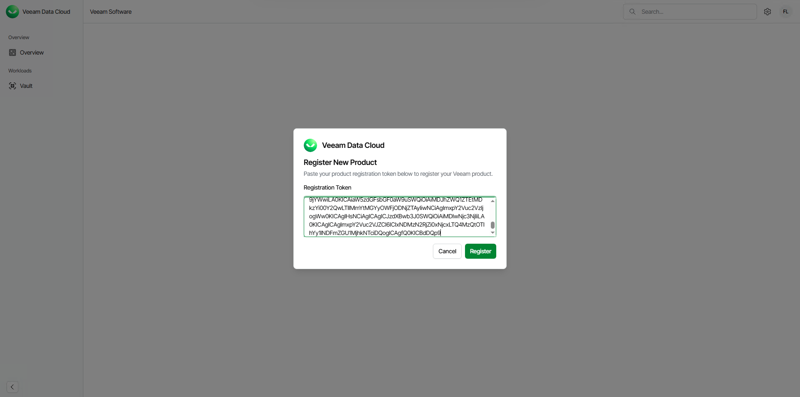
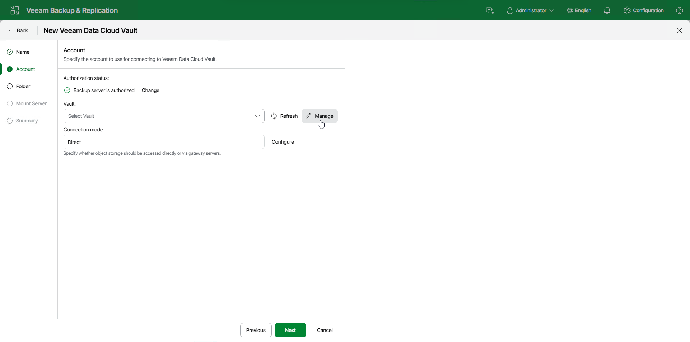
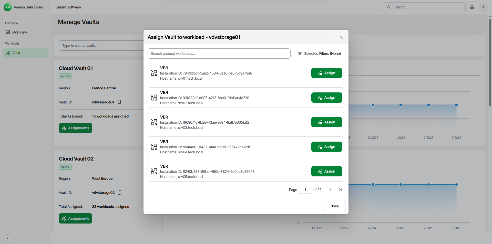
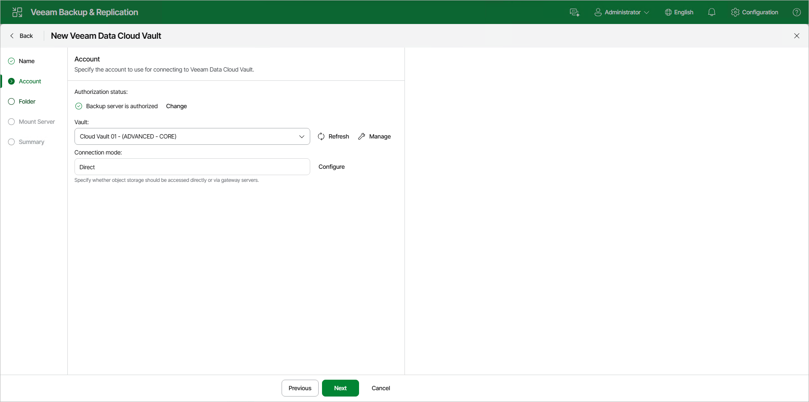

# Connecting Veeam Data Cloud Vault with Veeam Backup & Replication Using Web UI

You can use Veeam Data Cloud Vault as a target location for backups created by Veeam Backup & Replication. To do this, you must add a storage vault as an object storage repository in Veeam Backup & Replication and configure a backup job targeted at this repository.

For the Azure editions of Veeam Data Cloud Vault, you do not need to obtain credentials for the storage vault and provide them when connecting to Veeam Data Cloud Vault in Veeam Backup & Replication. Instead, you follow the procedure of connecting the products. Once the procedure is completed, Veeam Backup & Replication uses a security certificate to connect to Veeam Data Cloud Vault and transfer backup data to the target location over a secure connection.

|  |
| --- |
| Note |
| This section describes only the basic steps that you must take to connect Veeam Data Cloud Vault with Veeam Backup & Replication and start using Veeam Data Cloud Vault as an object storage repository in Veeam Backup & Replication. To get a detailed description of all Veeam Data Cloud Vault object storage repository settings, see the [Adding Veeam Data Cloud Vault Using Web UI](https://helpcenter.veeam.com/docs/vbr/userguide/vdcv_add_web.html?ver=13) section in the Veeam Backup & Replication User Guide. |

To connect Veeam Data Cloud Vault with Veeam Backup & Replication using web UI, do the following:

1. In the Veeam Backup & Replication web UI, launch the New Veeam Data Cloud Vault wizard:

1. In the management pane, click the Repositories node.
2. Select the Veeam Data Cloud Vault tab and click Get Veeam Vault.

1. At the Account step of the New Veeam Data Cloud Vault wizard, click Authorize.

1. In the Backup Server Registration Code window, click Copy to copy the registration code. You will use this code to authorize the Veeam Backup & Replication server in Veeam Data Cloud at the step 5 of this procedure.

1. In the Backup Server Registration Code window, click the Veeam Data Cloud Portal link.
2. In Veeam Data Cloud, in the Register New Product window, paste the registration code in the Registration Token field and click Register.

|  |
| --- |
| Note |
| To connect Veeam Backup & Replication to Veeam Data Cloud Vault, you must obtain a Veeam Data Cloud Vault subscription and create at least one storage vault in this subscription.  If you do not have a subscription, you can obtain it on the Veeam website. For more information, see [Obtaining Veeam Data Cloud Vault](vault_obtain_product.md).  If you have not created a storage vault, create it in Veeam Data Cloud. For more information, see [Adding Storage Vaults](vault_storage_vaults_add.md). |

1. Veeam will register the backup server in Veeam Data Cloud. In the Veeam Backup & Replication Web UI, in the Backup Server Registration Code window, click OK.
2. If you have only one storage vault that has not been assigned to any Veeam Backup & Replication server, Veeam Data Cloud Vault will automatically assign this storage vault to your backup server. In Veeam Backup & Replication, at the Account step of the New Veeam Data Cloud Vault wizard, the storage vault will be automatically selected in the Vault drop-down list.

Otherwise, click Manage next to the Vault drop-down list to assign a storage vault to the backup server in Veeam Data Cloud Vault.

1. In Veeam Data Cloud, assign the storage vault that you want to use as an object storage repository to Veeam Backup & Replication. To do this, do the following:

1. In Veeam Data Cloud, on the Manage Vaults page, locate the storage vault that you want to assign to Veeam Backup & Replication and click Assignments.
2. In the Assign Vault to workload window, click Assign next to the necessary Veeam Backup & Replication server.
3. In the confirmation window, click Continue.

If you have multiple storage vaults configured in Veeam Data Cloud Vault, repeat this step for all storage vaults you want to become available in Veeam Backup & Replication.

For more information, see [Assigning Storage Vaults to Workloads](vault_storage_vaults_edit.md#assign).

1. In the Veeam Backup & Replication web UI, at the Account step of the New Veeam Data Cloud Vault wizard, click Refresh. The storage Vault will become available in Veeam Backup & Replication. You can select the storage vault from the Vault drop-down list.

1. Complete the steps of the New Veeam Data Cloud Vault wizard to add the storage vault as an object storage repository in Veeam Backup & Replication.

For more information, see the [Adding Veeam Data Cloud Vault Using Web UI](https://helpcenter.veeam.com/docs/vbr/userguide/vdcv_add_web.html?ver=13) section in the Veeam Backup & Replication User Guide.

