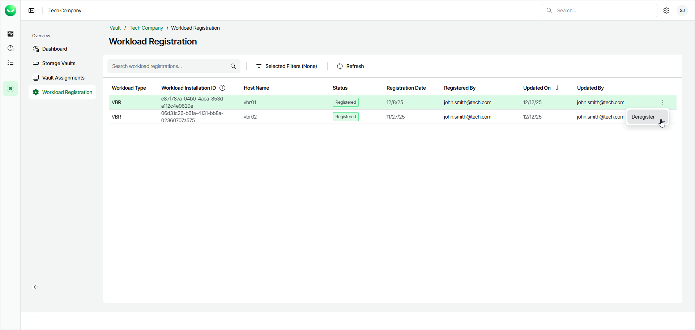

# Managing Workloads

In this article

You can manage workloads registered for use with Veeam Data Cloud Vault within your subscription. In terms of Veeam Data Cloud Vault, a workload is an installation of a Veeam product that can use a storage vault as a backup target. You can perform the following operations with Veeam Data Cloud Vault workloads:s

* [View a list of registered workloads](#view)
* [Deregister a workload](#deregister)

|  |
| --- |
| Note |
| If you use Veeam Data Cloud Vault with Veeam Backup & Replication, keep in mind that these operations are applicable to Azure editions of Veeam Data Cloud Vault and are not required for AWS editions. |

Viewing Registered Workloads

To view registered workloads:

1. On the Vault page, in the list of tenants, click the name of the tenant associated with the subscription for which you want to view registered workloads. Alternatively, in the Actions column of the list of tenants, click Manage next to the necessary tenant.
2. In the left menu, click Workload Registration.
3. On the Workload Registration page, view the list of workloads.

To quickly find the necessary workload, you can use the search field of filter workloads by the workload type.

To refresh the list of workloads, click Refresh.

For each item in the list, Veeam Data Cloud displays the following parameters:

* Workload Type

* Workload Installation ID

* Host Name
* Status
* Registered Date

* Registered By
* Updated On

* Updated By

Deregistering Workloads

You can remove registration of a workload if you do not plan to use it with Veeam Data Cloud Vault any longer.

Before you deregister a workload, you must unassign all storage vaults from this workload. For more information, see [Managing Storage Vaults](vault_storage_vaults_edit.md#unassign).

To deregister a workload:

1. On the Vault page, in the list of tenants, click the name of the necessary tenant. Alternatively, in the Actions column of the list of tenants, click Manage next to the necessary tenant.
2. In the left menu, click Workload Registration.
3. On the Workload Registration page, click the menu icon next to the workload that you want to deregister and click Deregister.
4. In the confirmation window, click Deregister.

|  |
| --- |
| Note |
| If you decide to use a deregistered workload with Veeam Data Cloud Vault later, you will need to register the workload in Veeam Data Cloud once again. For information on how to perform this operation for Veeam Backup & Replication, see [Connecting Veeam Data Cloud Vault with Veeam Backup & Replication](vault_vbr.md). |

Page updated 12/16/2025
